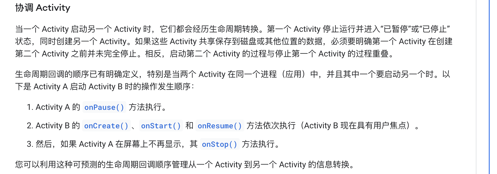

## Activity启动模式理解

1. standrad
2. singleTop
3. singleTask
4. singleInstance

### standrad

- 总是创建新的实例在当前的ActivityTask的栈上。
- taskAffinity没作用。因为总是在当前的ActivityTask上。
- 相当于在不同的ActivityTask上可以创建多个实例。

### singleTop

- 如果当前已经是同一个实例，则不再创建新实例，而是onNewIntent。其他情况同前者。

### singleTask

- 带有clearTop效果。当之前打开过此实例，后面在此task上插入了新的其他页面，又打开此页面时，会复用上次的，并清除所有之间的页面。
- 如果指定了taskAffinity，与当前的task不符合，则会在新的appTask中的栈上打开。

### singleInstance

- 与singleTask相似，但只允许自己出现在这个ActivityTask中。即使此时如果打开一个taskAffinity一样的但模式也是singleInstance的新页面时，这个task仍然只会保留新的页面，此时点击返回会退出。
- 实际上此时打开任何Activity都会离开此Task，在新的task中打开。包括上面的情况。

## activity生命周期细节

activity A -> activity B
activity A的stop一定是在activity B的resume之后。至于为什么，可以思考下动画，动动脑子也想得通。

## activity 启动
https://medium.com/android-news/android-application-launch-explained-from-zygote-to-your-activity-oncreate-8a8f036864b

- ActivityThread负责了不止一个activity的生命周期，而是所有此进程的activity。application的生命周期也是由它来负责，先bind application,再会有activity的transaction item，见`ActivityLifecycleItem`包括`StartActivityItem`, `ResumeActivityItem`，实际实现还是在activityThread。目前没有关于`applicationThread`的东西。