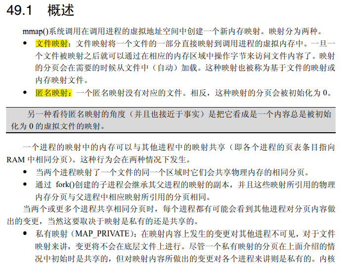
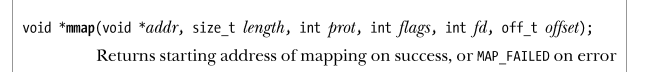
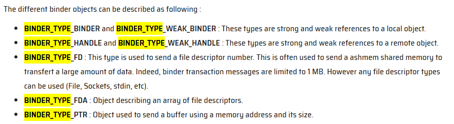

## 背景概述

Binder是一种基于Linux系统的进程间通信方式。起源于OpenBinder，经过多次公司转手开发，binder驱动程序在2014年左右已经合入到linux内核。

特点：

- 快速、单次拷贝。基于每个进程(`ProcessState::self()->init->open_driver()`, `mmap`)打开Binder驱动文件并mmap了一部分内存，以用于接受transaction数据。在通信时Binder只需要将数据从发起进程的用户空间写入到目标进程的mmap虚拟内存地址即可（在安卓8之前是三次拷贝，额外的两次在Parcel的序列化、反序列化，详见下文）。
- 面向对象。开发者友好。native或者java侧，都可以拿到服务接口的proxy（native靠模板和宏展开，java靠aidl生成），可以直接像调用本地对象的方法一样访问服务进程的功能。
- 安全/可订阅（死亡信息）
  
> 争议：由于linux缺乏对高速ipc的支持，出现了多种针对高速ipc的方式。而binder的争议主要在于，对同一个设备文件标识符，即`dev/binder`，在不同进程中的行为是不一样的。这个和大部分人的预期不符。
> 在争执了一段时间后还是合入了Linux，并且也被劝告它并不好用，使用者需要自行负责。

## 设计概述

每个进程都可以通过访问`dev/binder`标识符，来和binder驱动程序通信。而binder驱动程序提供了ipc的所需所有功能接口。

情景化思考：

思考这样一个问题，进程A，要和一个服务B通信，这个服务B既包括系统内置的系统服务，也包括用户应用提供的服务。而服务会动态变化，因此对于进程A来说，想要硬编码一个服务地址，并不可取，合理的设计应该是SPI，即ServiceProviderInterface，或者SL即ServiceLocator设计模式。于是应该有一个固定的服务地址，它所提供的核心服务便是查询其他服务的地址。

而`ServiceManager`，对应的`handle:0`，就是这个固定地址的系统服务，所扮演的角色就是服务管理器。它自己需要从binder驱动的`ioctl`来设置自己是管理者。而其他的服务进程需要借助binder驱动的`ioctl`来和serviceManager通信，调用它的`addService`服务来注册自己的服务。而对于进程A，则是依靠binder驱动`ioctl`来从`serviceManager`中获取某服务，比如传入特定枚举，以获得该枚举对应服务的`IBinder`，再转为`Proxy`来调用目标服务的功能。调用目标服务的功能时，本质上和`serviceManager`获取服务时的通信也没区别。


## 预备知识

在正式开始前需要先明确一些基本的知识。

#### alloc, malloc, calloc
alloc在栈上分配内存。
malloc是只分配内存，但需要Memset后才能访问。
而calloc是分配内存后，可以直接访问（都填0）。后两者是在进程堆上分配。

#### kzalloc, kmalloc
k前缀表示是从Kernel调用，用以区分从用户空间的调用。都是在内存堆中分配。前者会清零，后者不会。

#### mmap






#### current 

即当前的进程task_struct

#### pid tid tgid

pid=processId, tid=threadId。

在linux，线程在内核所维护的任务数据结构和进程一致，都是task_struct，所以tid就是线程对应task_struct里面的pid。而pid实际上是进程对应task_struct里面的tgid。也就是线程组id。对进程中的主线程来说，tid = pid = tgid。

因此会看到在binder driver里，binder_ioctl中对binder_thread的获取即当前线程的获取方式是在`flip->privateData(BinderProc)`对红黑树数据结构里的节点记录根据`current->pid`来比对查询。如果查询不到，则创建新的binder_thread节点插入其中。

## 通信流程描述

#### IBinder BBinder BpBinder

`IBinder`中包含`transact`等方法，有两个关键子类：

- `BBinder`（理解为Service的实现端），也就是真正实现了服务接口，一般在实现类中，等待Binder框架调用其onTransact->并解包数据，进而分发到接口方法上。
- `BpBinder`（理解为Client端），也就是服务接口的Proxy。客户端调用Proxy，Proxy负责封装数据、转为Parcel，进行后续的transact。

Parcel在`writeBinder`时，如果是写入`BBinder`，也就是服务实现端，会记录`binder_object_type: binder_type_binder`。若是代理端，则是`binder_type_handle`.这两种类型，会在binder驱动的`binder_transaction`方法中对应不同的行为。

```cpp
//已精简
status_t BpBinder::transact(
    uint32_t code, const Parcel& data, Parcel* reply, uint32_t flags)
{
   status = IPCThreadState::self()->transact(binderHandle(), code, data, reply, flags);
   return status;
}
```
即交由`IPCThreadState`，值得注意的是这里的`binderHandle()`，因为它将用于在此进程对应的Binder驱动中`binder_proc`结构里检索目标进程的`binder_ref_node`。换句话说，BpBinder的`transact`方法虽然没暴露`handle`参数，但它的内部成员`mHandle`在BpBinder构造时便得到了此代理所对应的在该进程中的`handle`值。

更进一步来讲，BpBinder的创建主要分两种：

- handle为0表示`ServiceManager`的BpBinder。
- 通过`ServiceManager`的功能接口得到的返回结果里包含了IBinder，此时会在解包的过程中经由`Parcel.readStrongBinder` ..-> `Parcel.unflatternBnder`：
  
```cpp
status_t Parcel::unflattenBinder(sp<IBinder>* out) const
{
        switch (flat->hdr.type) {
            case BINDER_TYPE_BINDER: {
                sp<IBinder> binder =
                        sp<IBinder>::fromExisting(reinterpret_cast<IBinder*>(flat->cookie));
               // 这里代表是本地binder
                return finishUnflattenBinder(binder, out);
            }
            case BINDER_TYPE_HANDLE: {
                sp<IBinder> binder =
                    ProcessState::self()->getStrongProxyForHandle(flat->handle);
               // 此路径最终会调用到 BpBinder::PrivateAccessor::create(handle);即创建了此handle的BpBinder
                return finishUnflattenBinder(binder, out);
            }
        }
}
```
关于IBinder的type有如下说明：



#### ProcessState

进程单例。构造方法如下：
```cpp
//已精简
ProcessState::ProcessState(const char* driver)
      : mDriverName(String8(driver)),
        mDriverFD(-1),
        mMaxThreads(DEFAULT_MAX_BINDER_THREADS) {
    base::Result<int> opened = open_driver(driver);
        // mmap the binder, providing a chunk of virtual address space to receive transactions.
        mVMStart = mmap(nullptr, BINDER_VM_SIZE, PROT_READ, MAP_PRIVATE | MAP_NORESERVE,
                        opened.value(), 0);
        mDriverFD = opened.value();
}

static base::Result<int> open_driver(const char* driver) {
    int fd = open(driver, O_RDWR | O_CLOEXEC);
    status_t result = ioctl(fd, BINDER_VERSION, &vers);
    size_t maxThreads = DEFAULT_MAX_BINDER_THREADS;
    result = ioctl(fd, BINDER_SET_MAX_THREADS, &maxThreads);
    return fd;
}
```
即打开Binder驱动，并以打开的fd来映射一片虚拟内存、只读、私有。这里也简单看下Binder驱动中的处理：
```cpp
//已精简
static int binder_open(struct inode *nodp, struct file *filp)
{
	proc = kzalloc(sizeof(*proc), GFP_KERNEL);
	if (proc == NULL)
		return -ENOMEM;
	INIT_LIST_HEAD(&proc->todo);
	init_waitqueue_head(&proc->freeze_wait);
	proc->context = &binder_dev->context;
	binder_alloc_init(&proc->alloc);
	binder_stats_created(BINDER_STAT_PROC);
	proc->pid = current->group_leader->pid;
	INIT_LIST_HEAD(&proc->delivered_death);
	INIT_LIST_HEAD(&proc->waiting_threads);
	filp->private_data = proc;
	return 0;
}
static int binder_mmap(struct file *filp, struct vm_area_struct *vma)
{
	struct binder_proc *proc = filp->private_data;
	return binder_alloc_mmap_handler(&proc->alloc, vma);
}
/**
 * binder_alloc_mmap_handler() - map virtual address space for proc
 * @alloc:	alloc structure for this proc
 * @vma:	vma passed to mmap()
 *
 * Called by binder_mmap() to initialize the space specified in
 * vma for allocating binder buffers
 *
 * Return:
 *      0 = success
 *      -EBUSY = address space already mapped
 *      -ENOMEM = failed to map memory to given address space
 */
int binder_alloc_mmap_handler(struct binder_alloc *alloc,
			      struct vm_area_struct *vma)
{
	alloc->buffer = (void __user *)vma->vm_start;
	alloc->pages = kcalloc(alloc->buffer_size / PAGE_SIZE,
			       sizeof(alloc->pages[0]),
			       GFP_KERNEL);
	buffer->user_data = alloc->buffer;
	list_add(&buffer->entry, &alloc->buffers);
	buffer->free = 1;
	binder_insert_free_buffer(alloc, buffer);
	alloc->free_async_space = alloc->buffer_size / 2;
	binder_alloc_set_vma(alloc, vma);
	mmgrab(alloc->vma_vm_mm);
	return 0;
}
```
当实现驱动程序时，open方法签名是`int (*open)(struct inode *inode, struct file *filp); `。其中，filp是file pointer即文件指针的含义。在驱动程序的open方法中，一般会分配并填充要放进 `filp->private_data` 的任何数据结构。Binder驱动也不例外，它的`flip->private_data`是`binder_proc`结构。

之后在mmap的处理中，由Binder 驱动申请了一块内存并登记在`binder_proc`结构体中。

#### IPCThreadState

具体的IPC线程状态，线程内单例，负责IPC事务，构造方法如下：
```cpp
// 已精简
IPCThreadState::IPCThreadState()
      : mProcess(ProcessState::self()){
    pthread_setspecific(gTLS, this);
    mIn.setDataCapacity(256);
    mOut.setDataCapacity(256);
}
```
它的transact方法代码精简如下：
```cpp
status_t IPCThreadState::transact(int32_t handle,
                                  uint32_t code, const Parcel& data,
                                  Parcel* reply, uint32_t flags)
{
    err = writeTransactionData(BC_TRANSACTION, flags, handle, code, data, nullptr);
    if ((flags & TF_ONE_WAY) == 0) {
        if (reply) {
            err = waitForResponse(reply);
        } else {
            Parcel fakeReply;
            err = waitForResponse(&fakeReply);
        }
    } else {
        err = waitForResponse(nullptr, nullptr);
    }
    return err;
}
```
即写入事务数据，等待响应。若需要回复，即需要服务端的服务返回数据，则传入有效的reply指针。`writeTransactionData`会把`Parcel`数据进一步包装为`binder_transaction_data`数据结构。这里面有cmd是`BC_TRANSACTION`，code是对服务端方法的编号。cmd的取值分为`BC_`前缀和`BR_`前缀，由`Binder`驱动发起的是`BR_`前缀，由进程发起的是`BC_`前缀。


```cpp
// 已精简
status_t IPCThreadState::waitForResponse(Parcel *reply, status_t *acquireResult)
{
    while (1) {
        if ((err=talkWithDriver()) < NO_ERROR) break;
        cmd = (uint32_t)mIn.readInt32();
        switch (cmd) {
        case BR_TRANSACTION_COMPLETE:
            if (!reply && !acquireResult) goto finish;
            break;
        case BR_REPLY:
            {
                binder_transaction_data tr;
                err = mIn.read(&tr, sizeof(tr));
                if (reply) {
                    if ((tr.flags & TF_STATUS_CODE) == 0) {
                        reply->ipcSetDataReference(
                            reinterpret_cast<const uint8_t*>(tr.data.ptr.buffer),
                            tr.data_size,
                            reinterpret_cast<const binder_size_t*>(tr.data.ptr.offsets),
                            tr.offsets_size/sizeof(binder_size_t),
                            freeBuffer);
                    } else {
                        err = *reinterpret_cast<const status_t*>(tr.data.ptr.buffer);
                    }
                } else {
                }
            }
        default:
            err = executeCommand(cmd);
            if (err != NO_ERROR) goto finish;
            break;
        }
    }
    return err;
}
// 大幅精简
status_t IPCThreadState::talkWithDriver(bool doReceive)
{
    binder_write_read bwr;
    do {
        if (ioctl(mProcess->mDriverFD, BINDER_WRITE_READ, &bwr) >= 0)
            err = NO_ERROR;
    } while (err == -EINTR);
    return err;
}
```
`waitForResponse`的工作主要是准备`binder_write_read`数据，通过ioctl提交此数据。等待返回结果。

#### Binder 驱动

```cpp
static long binder_ioctl(struct file *filp, unsigned int cmd, unsigned long arg)
{
   struct binder_proc *proc = filp->private_data;
	struct binder_thread *thread;
   thread = binder_get_thread(proc);
	switch (cmd) {
	case BINDER_WRITE_READ:
		ret = binder_ioctl_write_read(filp, cmd, arg, thread);
		break;
	case BINDER_SET_MAX_THREADS: {
		int max_threads;

		if (copy_from_user(&max_threads, ubuf,
				   sizeof(max_threads))) {
		}
		proc->max_threads = max_threads;
		break;
	}
	case BINDER_SET_CONTEXT_MGR:
		ret = binder_ioctl_set_ctx_mgr(filp, NULL);
		break;
}


static int binder_ioctl_write_read(struct file *filp,
				unsigned int cmd, unsigned long arg,
				struct binder_thread *thread)
{
	int ret = 0;
	struct binder_proc *proc = filp->private_data;
	struct binder_write_read bwr;

	if (bwr.write_size > 0) {
		ret = binder_thread_write(proc, thread,
					  bwr.write_buffer,
					  bwr.write_size,
					  &bwr.write_consumed);
	}
	if (bwr.read_size > 0) {
      //非阻塞读取
		ret = binder_thread_read(proc, thread, bwr.read_buffer,
					 bwr.read_size,
					 &bwr.read_consumed,
					 filp->f_flags & O_NONBLOCK);
		if (!binder_worklist_empty_ilocked(&proc->todo))
			binder_wakeup_proc_ilocked(proc);
	}
	if (copy_to_user(ubuf, &bwr, sizeof(bwr))) {
	}
	return ret;
}
//即先写再读。来看写
static int binder_thread_write(struct binder_proc *proc,
			struct binder_thread *thread,
			binder_uintptr_t binder_buffer, size_t size,
			binder_size_t *consumed)
{
	uint32_t cmd;
	struct binder_context *context = proc->context;
	void __user *buffer = (void __user *)(uintptr_t)binder_buffer;
	void __user *ptr = buffer + *consumed;
	void __user *end = buffer + size;

	while (ptr < end && thread->return_error.cmd == BR_OK) {
		int ret;

		if (get_user(cmd, (uint32_t __user *)ptr))
			return -EFAULT;
		ptr += sizeof(uint32_t);
		switch (cmd) {
      ...
		case BC_TRANSACTION:
		case BC_REPLY: {
			struct binder_transaction_data tr;

			if (copy_from_user(&tr, ptr, sizeof(tr)))
				return -EFAULT;
			ptr += sizeof(tr);
			binder_transaction(proc, thread, &tr,
					   cmd == BC_REPLY, 0);
			break;
		}
		case BC_REGISTER_LOOPER:
		case BC_ENTER_LOOPER:
		case BC_EXIT_LOOPER:
		case BC_REQUEST_DEATH_NOTIFICATION:
		case BC_CLEAR_DEATH_NOTIFICATION: 
		case BC_DEAD_BINDER_DONE: 
      ...
	}
	return 0;
}
// 因为是BC_TRANSACTION，它以copy_from_user系统调用从用户空间把binder_transaction_data拷贝，接下来进入binder_transaction

static void binder_transaction(struct binder_proc *proc,
			       struct binder_thread *thread,
			       struct binder_transaction_data *tr, int reply,
			       binder_size_t extra_buffers_size)
{

	if (reply) {
		in_reply_to = thread->transaction_stack;
		target_proc = target_thread->proc;
		target_proc->tmp_ref++;
	} else {
		if (tr->target.handle) {
			struct binder_ref *ref;
			ref = binder_get_ref_olocked(proc, tr->target.handle,
						     true);
						ref->node, &target_proc,
						&return_error);
			}
		} else {
			target_node = context->binder_context_mgr_node;
		}
		w = list_first_entry_or_null(&thread->todo,
					     struct binder_work, entry);
		if (!(tr->flags & TF_ONE_WAY) && thread->transaction_stack) {
			struct binder_transaction *tmp;

			tmp = thread->transaction_stack;
			while (tmp) {
				struct binder_thread *from;
				if (from && from->proc == target_proc) {
					atomic_inc(&from->tmp_ref);
					target_thread = from;
					spin_unlock(&tmp->lock);
					break;
				}
			}
		}
	}
	if (target_thread)
		e->to_thread = target_thread->pid;
	e->to_proc = target_proc->pid;

	t = kzalloc(sizeof(*t), GFP_KERNEL);

	INIT_LIST_HEAD(&t->fd_fixups);
	tcomplete = kzalloc(sizeof(*tcomplete), GFP_KERNEL);

	if (!reply && !(tr->flags & TF_ONE_WAY))
		t->from = thread;
	else
		t->from = NULL;
	t->to_proc = target_proc;
	t->to_thread = target_thread;
	t->code = tr->code;
	t->flags = tr->flags;
   // 给目标进程分配新的buffer。
	t->buffer = binder_alloc_new_buf(&target_proc->alloc, tr->data_size,
		tr->offsets_size, extra_buffers_size,
		!reply && (t->flags & TF_ONE_WAY), current->tgid);
	t->buffer->transaction = t;
	t->buffer->target_node = target_node;

   // 拷贝数据到目标进程的buffer。
	if (binder_alloc_copy_user_to_buffer(
				&target_proc->alloc,
				t->buffer,
				ALIGN(tr->data_size, sizeof(void *)),
				(const void __user *)
					(uintptr_t)tr->data.ptr.offsets,
				tr->offsets_size)) {
	}
	for (buffer_offset = off_start_offset; buffer_offset < off_end_offset;
	     buffer_offset += sizeof(binder_size_t)) {
		struct binder_object_header *hdr;
		size_t object_size;
		struct binder_object object;
		binder_size_t object_offset;

      // 拷贝位移量。object_offset到目标Buffer
		if (binder_alloc_copy_from_buffer(&target_proc->alloc,
						  &object_offset,
						  t->buffer,
						  buffer_offset,
						  sizeof(object_offset))) {
		}
		object_size = binder_get_object(target_proc, t->buffer,
						object_offset, &object);

		hdr = &object.hdr;
		off_min = object_offset + object_size;
		switch (hdr->type) {
		case BINDER_TYPE_BINDER:
		case BINDER_TYPE_WEAK_BINDER: {
			struct flat_binder_object *fp;

			fp = to_flat_binder_object(hdr);
			ret = binder_translate_binder(fp, t, thread);

         // 拷贝fp到目标Buffer
			if (ret < 0 ||
			    binder_alloc_copy_to_buffer(&target_proc->alloc,
							t->buffer,
							object_offset,
							fp, sizeof(*fp))) {
			}
		} break;
		case BINDER_TYPE_HANDLE:
		case BINDER_TYPE_WEAK_HANDLE: {
			struct flat_binder_object *fp;

			fp = to_flat_binder_object(hdr);
			ret = binder_translate_handle(fp, t, thread);
			if (ret < 0 ||
			    binder_alloc_copy_to_buffer(&target_proc->alloc,
							t->buffer,
							object_offset,
							fp, sizeof(*fp))) {
			}
		} break;

	if (reply) {
      // 是reply，原线程添加work: tcomplete
		binder_enqueue_thread_work(thread, tcomplete);
		binder_pop_transaction_ilocked(target_thread, in_reply_to);
      // 目标线程添加work: t->work
		binder_enqueue_thread_work_ilocked(target_thread, &t->work);
		target_proc->outstanding_txns++;
      // 唤醒目标线程
		wake_up_interruptible_sync(&target_thread->wait);
	} else if (!(t->flags & TF_ONE_WAY)) {
      // 若不是one way，原线程添加work: tcomplete
		binder_enqueue_deferred_thread_work_ilocked(thread, tcomplete);
      // 记录事务栈，以在后续回复时找到上下文
		t->need_reply = 1;
		t->from_parent = thread->transaction_stack;
		thread->transaction_stack = t;
      //唤醒目标进程
		return_error = binder_proc_transaction(t,
				target_proc, target_thread);
	} else {
       // 是one way，原线程添加work: tcomplete
		binder_enqueue_thread_work(thread, tcomplete);
      //唤醒目标进程
		return_error = binder_proc_transaction(t, target_proc, NULL);
	}
	return;
}

// 对于发起进程，此时事务完成，thread会被添加tcomplete的binder_work，type为BINDER_WORK_TRANSACTION_COMPLETE
// 对于目标进程，会被添加t->work的binder_work，type为BINDER_WORK_TRANSACTION。 下面是读：
static int binder_thread_read(struct binder_proc *proc,
			      struct binder_thread *thread,
			      binder_uintptr_t binder_buffer, size_t size,
			      binder_size_t *consumed, int non_block)
{
	void __user *buffer = (void __user *)(uintptr_t)binder_buffer;
	void __user *ptr = buffer + *consumed;
	void __user *end = buffer + size;
	while (1) {
		uint32_t cmd;

		if (!binder_worklist_empty_ilocked(&thread->todo))
			list = &thread->todo;
		else if (!binder_worklist_empty_ilocked(&proc->todo) &&
			   wait_for_proc_work)
			list = &proc->todo;

		w = binder_dequeue_work_head_ilocked(list);
		switch (w->type) {
		case BINDER_WORK_TRANSACTION: {
         //目标进程被唤起后读取任务会走到这里
			binder_inner_proc_unlock(proc);
			t = container_of(w, struct binder_transaction, work);
		} break;
		case BINDER_WORK_TRANSACTION_COMPLETE:
         //这个是发起进程的分支。即tcomplete的binder_work
      case BINDER_WORK_TRANSACTION_ONEWAY_SPAM_SUSPECT: {
			if (proc->oneway_spam_detection_enabled &&
				   w->type == BINDER_WORK_TRANSACTION_ONEWAY_SPAM_SUSPECT)
				cmd = BR_ONEWAY_SPAM_SUSPECT;
			else
				cmd = BR_TRANSACTION_COMPLETE;
         //将cmd复制到用户空间。以便IPCThreadState读取。      
			if (put_user(cmd, (uint32_t __user *)ptr))
			ptr += sizeof(uint32_t);

		} break;
		...

		if (t->buffer->target_node) {
			cmd = BR_TRANSACTION;
		} else {
			trd->target.ptr = 0;
			trd->cookie = 0;
			cmd = BR_REPLY;
		}
		ptr += sizeof(uint32_t);
      //将事务复制到用户空间，即读入。
		if (copy_to_user(ptr, &tr, trsize)) {
		}
		ptr += trsize;
	}
	return 0;
}
```
综上，我们大致看完了一次Binder的通信过程。

#### 唤醒方式

在Linux驱动程序中，会使用`wait_list`数据结构来处理。


## 标准场景描述

### ServiceManager启动

第一个被启动。除了对binder驱动进行open, mmap之外，还会通过几次`ioctl`来把自己设置为context manager。此后，会进入binder_loop方法，不断的等待binder驱动数据，再解析执行指令。


### 服务注册

服务Servcice B注册过程如下：

1. Service B 获取ServiceManager。
2. 调用IServiceManager.addService。

此外它还需要至少开启一个线程来准备IPC通信，通过`ProcessState::startThreadPool`  ..`ThreadLoop`.->  `IPCThreadState.joinThreadPool()`，如`main_surfaceflinger.cpp`的主方法。

此过程会开启一个线程完全用于IPC。它会调用到`IPCThreadState.jinThreadPool`来等待通信。

`IPCThreadState joinThreadPool()` 逻辑本质就是一个死循环，不断进行 `IPCThreadState.getAndExecuteCommand()`。而此过程则是`IPCThreadState.talkWithDriver`来获取新的指令，然后调用`IPCThreadState.executeCommand`来执行。`talkWithDriver`上面`transact`时已经提到过，这里不再重复。`executeCommand`则如下：

```cpp
//大幅精简
status_t IPCThreadState::executeCommand(int32_t cmd)
{
    switch ((uint32_t)cmd) {
    case BR_TRANSACTION:
        {
            Parcel reply;
            status_t error;
            if (tr.target.ptr) {
                // We only have a weak reference on the target object, so we must first try to
                // safely acquire a strong reference before doing anything else with it.
                if (reinterpret_cast<RefBase::weakref_type*>(
                        tr.target.ptr)->attemptIncStrong(this)) {
                    error = reinterpret_cast<BBinder*>(tr.cookie)->transact(tr.code, buffer,
                            &reply, tr.flags);
                    reinterpret_cast<BBinder*>(tr.cookie)->decStrong(this);
                }
            }
            if ((tr.flags & TF_ONE_WAY) == 0) {
                sendReply(reply, (tr.flags & kForwardReplyFlags));
            }
        }
        break;
      ...
}
```
因为服务端对我们来说最关注的是`BR_TRANSACTION`，即Binder驱动发起事务指令（对应之前的发起进程的`BC_TRANSACTION`）。此时会看到它将tr.cookie强转为BBinder来调用`transact`从而到`BBinder`解包数据，根据code再分发到具体的服务方法调用。以及对`reply`的回写。

### 应用进程

应用进程Proc A 需要通过Binder跨进程来调用Service B 的过程如下：

1. Proc A 获取`ServiceManager`
   1. 此过程仅需要`ProcessState`参与。`ServiceManager`会有一些本地的包装类，以确保在本地只需要创建一个`ServiceManagerProxy`单例即可。第一次创建时，通过`ProcessState::self()->getStrongProxyForHandle(null)`即可，也就是创建了一个`handle:0`的`BpBinder`。
   - 注意：大部分`BpBinder`的创建都是由`ProcessState`进行的，因为它维护了当前进程下的`BpBinder`列表
2. Proc A 调用`IServiceManager`的`getService(...)`方法，获取Service B的Proxy。
   1. 此时因为`ServiceManagerProxy`的本地缓存还没有此类`BpBinder`（这里的`ServiceManagerProxy`泛指`ServiceManager`的本地包装类），需要进行ipc获取。因此需要由`IServiceManager`发起一次transact来调用服务端的getService方法。其内部Code是`GET_SERVICE`。
   2. Proc A在transact过程中，out数据主要是要查询的服务名称。transact的过程主要是对方法调用参数parcel序列化，`BpBinder.transact->...IPCThreadState.transact->talkWithDriver, waitForResponse`。而`talkWithDriver`又是ioctl调用`binder_write_read`过程，此时的事务数据已经封装为了bwr(binder_write_read)结构体。
   3. binder驱动侧会通过ioctl调用的描述符参数flip的`privateData`，取出`Binder_proc`结构体，它记录了Binder在该进程上的信息。此字段初始化与`ProcessState`的初始化有关，详见上面，不再赘述。再从`binder_proc`的结构体中获取当前线程结构体信息，它是通过`binder_proc`里面的`binder_thread`红黑树记录，以`current->pid`比对。此时已经有`了proc,thread`两个主要环境数据，然后根据不同ioctl的cmd来处理。
   4. `binder_ioctl->binder_ioctl_write_read`拷贝了transaction数据之后进入`binder_transaction`方法。
   5. `binder_transaction`：
      1. 获取targetNode, 以此得到targetProc, targetThread, targetBuffer，也就是确定要写入的目标缓存地址。
         1. 如果不是回复结果，则看transactionData里若有target.handle，那么直接在当前进程proc的binder_node红黑树记录里面去找就可以了，比对handle。若没有，也就是0，此时把binder驱动中context_manager也就是serviceManager作为targetNode。
         2. 若是回复，那么直接从thread的transaction_stack里的From内容就可以找到targetThread等。
      2. 分配空间，拷贝transactionData数据，到target_proc->alloc。
      3. 在proc，targetProc记录适当的binderNode。主要是在注册服务时，SerivceManager进程的proc记录服务进程的Binder_node_ref。以及在获取服务时，在请求进程的proc记录服务提供进程的binder_node_ref。以此可以确保后面再进行ioctl的时候，binder driver能知道发起进程的handle所指的目标binder_node到底是什么、在哪里。
      4. 唤醒目标线程。
   6. 等待结果。之后读取结果数据。Parcel解包的时候，会readStrongBinder->ProcessState::getStrongProxyForHandle(handle)，ProcessState会检查是否已经有维护，若没有，则构造一个BpBinder返回。
   7. 将BpBinder转为Proxy，对于native的转化借助宏和模板，对于java的转化，借助aidl生成的Proxy类。此时，就可以对BpBinder调用其transact方法，来得到对应的功能了。也可以使用Proxy直接调用接口方法。
3. 用Proxy调用Service B 方法。
   1. 此时流转到BpBinder->transact，同2.2。不外乎写parcel和解parcel时数据不同，以及handle不同也就是在binder_transaction时，得到的target_node不同，即要写入的目标地址不同、唤醒的线程不同。
   
## 三次复制和一次复制

根据官网说法，在安卓8之前其实BinderIPC是三次复制，在安卓8之后是一次复制。减去的两次是序列化和反序列化的过程。详见拓展阅读。用图片来说明下：

三次复制


安卓8之后一次复制


## 总结

众所周知 Binder IPC 在安卓系统上使用异常普遍，以至于很多时候几乎会忽略它背后的复杂性。我先总结下它的解决方案整体思路，再总结由此得出的更多思考。

- 为了给用户在跨进程时更好的使用体验，几乎像访问本地方法一样调用远程服务方法。为此提供了动态代理，与调用“存根”。将大部分的调用抽象为事务，将方法的参数、名称等编码打包。进而在远端解包还原出方法调用。
- 对于定位远程服务，用户习惯于使用服务名称，即类似互联网域名一样。而对方案内部来说，需要具备把“服务名”解析到具体服务进程的能力。由此需要实现一套进程间的“服务定位器”设计模式。即提供一个众做周知的固定地址作为管理者、服务定位者。后续所有操作皆基于此来互相发现。
- 考虑至此，其实并非一定要用Binder，其他的Linux提供的IPC方式依然能满足这些诉求，Socket也好、pipeline也罢等等。只是Binder给出了一个理论上性能更好的选项。但它不得不借助自定义驱动程序，来让进程内留有一块和该驱动fd关联的mmap映射地址。这块地址用户空间可以访问，而对驱动程序在内核模式下来说，它接收到通信数据后，只需要取出目标进程的mmap映射地址写入数据包即可。

因为这套方案复杂，涉及所有的细节几乎难以做到，由此受到启发是什么？更宽泛的思考是什么？

- 其实是进程的独立环境，使得之间的通信变得较为复杂。安全、沙盒，和更自由的通信，这两者有种博弈的关系。如果未来有更好的方式避免进程崩溃导致的稳定性问题、也有更好的方式规避进程间不安全的访问问题，使得进程之间的隔离不再那么死板，自然就会有更轻松的进程间通信。
- 进程通信往往涉及开发者体验、业务诉求（性能、安全性、可监听）、操作系统层面的考虑。

暂时还没有什么更奇妙的想法了。

## 拓展阅读

- [binder.c](https://github.com/torvalds/linux/blob/master/drivers/android/binder.c)
- [binder_alloc.c](https://github.com/torvalds/linux/blob/ef1244124349fea36e4a7e260ecaf156b6b6b22a/drivers/android/binder_alloc.c)
- [ProcessState.cpp](https://cs.android.com/android/platform/superproject/+/master:frameworks/native/libs/binder/ProcessState.cpp;l=472;drc=master;bpv=1;bpt=1)
- [IPCThreadState.cpp](https://cs.android.com/android/platform/superproject/+/master:frameworks/native/libs/binder/IPCThreadState.cpp;drc=master;l=1003?q=IPCThreadState.cpp&ss=android%2Fplatform%2Fsuperproject)
- [BpBinder.cpp](https://cs.android.com/android/platform/superproject/+/master:frameworks/native/libs/binder/BpBinder.cpp;l=303;bpv=0;bpt=1)
- [良好的Binder概述，包括安卓8的改进](https://www.pathpartnertech.com/android-binder-ipc-framework-scatter-gather-optimization/)
- [另一篇次良好的概述](https://www.synacktiv.com/en/publications/binder-transactions-in-the-bowels-of-the-linux-kernel.html)
- [Binder在安卓8的改进](https://source.android.com/devices/architecture/hidl/binder-ipc#scatter)，由三次拷贝变为真正的一次拷贝。
- 关于Linux系统调用和驱动程序，请参阅“操作系统”section。