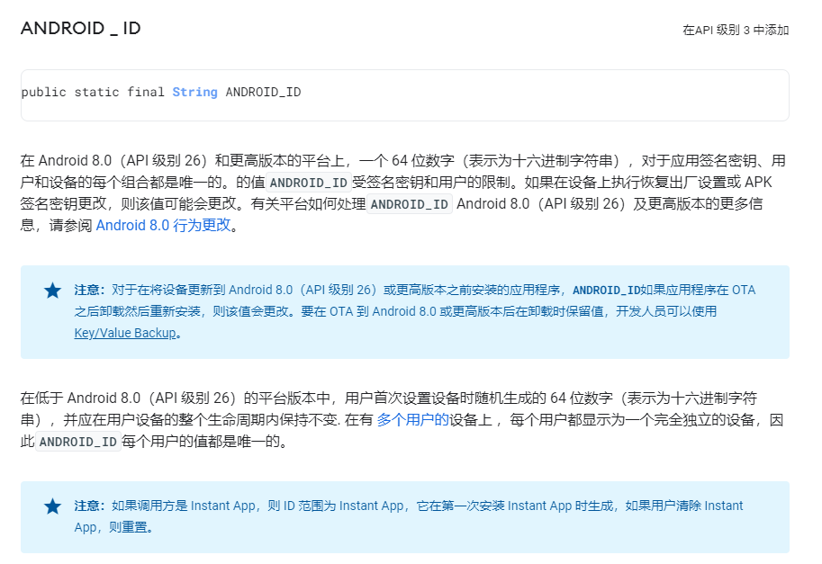

对于只需要在“安装周期”内唯一的id，使用UUID即可。
```
UUID.randomUUID()
```

对于需要在“设备周期”内唯一的id(即除了恢复出厂设置时会重置的id），使用SSAID。
```
String androidId = Settings.Secure.getString(getContentResolver(),
                     Settings.Secure.ANDROID_ID);
```
此id更适合配置实验和黑白名单等。



## 拓展阅读

- [最佳实践](https://developer.android.com/training/articles/user-data-ids)
- [5种方法](https://ssaurel.medium.com/how-to-retrieve-an-unique-id-to-identify-android-devices-6f99fd5369eb)
- [UUID](https://developer.android.com/reference/java/util/UUID)
- [SSAID](https://developer.android.com/reference/android/provider/Settings.Secure#ANDROID_ID)