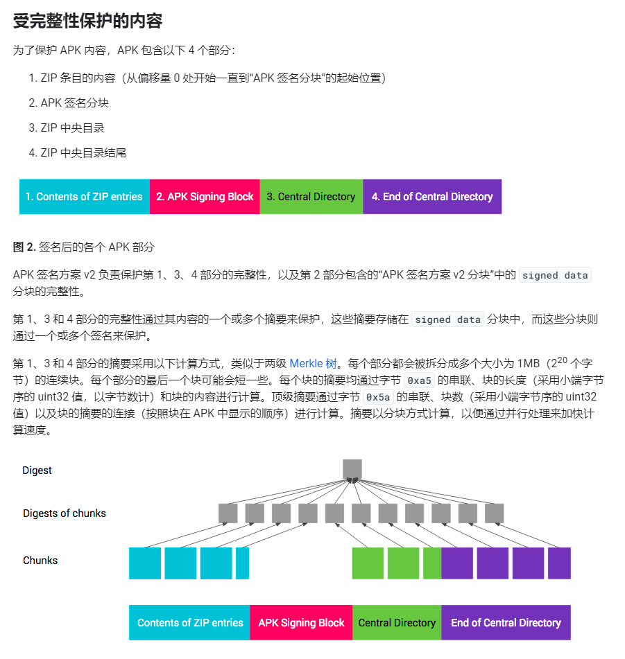

## 包签名验证

### v1签名

因为APK本质是JAR更是ZIP文件，因此提供了类似jarsigner的工具——apksigner，与jarsigner功能非常相似，不同点在于除了直接提供jks的keystore文件方式外，还可以单独提供PKCS #8 格式的私钥文件和x.509的证书文件（[详见](https://developer.android.com/studio/command-line/apksigner?hl=zh-cn)）。

关于jar的签名，请参见“Java”section。

对于更新安装apk，系统只需要确保新的apk能够完成签名验证，并且是由同一个实体（公钥）提供的签名即可

### v2签名

由于v1签名的验证需要解压缩才能进行，对于动辄上百M的包并不友好。且无法保护zip的元数据部分。从v2签名开始提供了新的方式。

在zip文件中增加了apk签名分块。此分块的数据包含多个“ID - 值”对组成。对于每个签名者，会存储：

- （签名算法、摘要、签名）元组。摘要会存储起来，以便将签名验证和 APK 内容完整性检查拆开进行。
- 表示签名者身份的 X.509 证书链。
- 采用键值对形式的其他属性。

具体格式和ID取值见官方文档。验证时，会对zip的其他分块拆分成大小为1MB的连续块，对每个拆分块计算摘要，并和签名分块中的摘要对比。此过程可以更好利用并发来加速验证。

### v3签名

从安卓9开始提供了v3方案。形式依然采用v2的形式，但在分块中又增加了更多的“ID - 值”对，用于支持“APK秘钥轮替”特性。

## 包加固

类加载字节数组加密解密

## 拓展阅读

- [v1签名](https://source.android.com/security/apksigning?hl=zh-cn#v1)
- [v2签名](https://source.android.com/security/apksigning/v2?hl=zh-cn#apk-signing-block)
- [v3签名](https://source.android.com/security/apksigning/v3?hl=zh-cn)
- [apksigner](https://developer.android.com/studio/command-line/apksigner?hl=zh-cn)