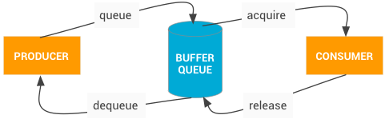

渲染是一个复杂且宽泛的话题。对它描述时不得不分成多层：

- 应用层（即我们编写的App）
- 渲染框架层（由应用引入，比如原生的View/跨端的Compose/Flutter/RN/etc...）
- 平台渲染框架层（从应用进程内的平台框架到系统服务进程内的服务）
- OpenGL/Vulkan & 系统内核层 & 硬件层

而本文内容主要讨论其中的第三层，对于第二层的渲染框架，可以参阅“跨端技术”section。

## 应用进程内

先记录几个重要的堆栈，方便快速参考。

### activity首次渲染调用栈
也就是在activityThread#handleResumeActivity的时候，注意并非是在其他Activity生命周期，而是Resume。

```
scheduleTraversals:1946, ViewRootImpl (android.view)        
requestLayout:1632, ViewRootImpl (android.view)
setView:981, ViewRootImpl (android.view)
addView:399, WindowManagerGlobal (android.view)
addView:95, WindowManagerImpl (android.view)
handleResumeActivity:4638, ActivityThread (android.app)     <------重点开始
execute:52, ResumeActivityItem (android.app.servertransaction)
executeLifecycleState:181, TransactionExecutor (android.app.servertransaction)
execute:102, TransactionExecutor (android.app.servertransaction)
handleMessage:2239, ActivityThread$H (android.app)
dispatchMessage:107, Handler (android.os)
loop:237, Looper (android.os)
main:7830, ActivityThread (android.app)
invoke:-1, Method (java.lang.reflect)
run:492, RuntimeInit$MethodAndArgsCaller (com.android.internal.os)
main:1040, ZygoteInit (com.android.internal.os)
```

### View.draw的一般调用栈

```
onDraw:43, MainActivity$TestView (org.tu.android)
draw:21813, View (android.view)
updateDisplayListIfDirty:20642, View (android.view)
draw:21525, View (android.view)
drawChild:4542, ViewGroup (android.view)
dispatchDraw:4279, ViewGroup (android.view)
draw:21820, View (android.view)
draw:869, DecorView (com.android.internal.policy)
updateDisplayListIfDirty:20642, View (android.view)
updateViewTreeDisplayList:575, ThreadedRenderer (android.view)
updateRootDisplayList:581, ThreadedRenderer (android.view)
draw:654, ThreadedRenderer (android.view)
draw:4129, ViewRootImpl (android.view)
performDraw:3917, ViewRootImpl (android.view)
performTraversals:3223, ViewRootImpl (android.view)
doTraversal:2054, ViewRootImpl (android.view)
run:8459, ViewRootImpl$TraversalRunnable (android.view)
run:1065, Choreographer$CallbackRecord (android.view)
doCallbacks:889, Choreographer (android.view)
doFrame:816, Choreographer (android.view)             <------重点开始
run:1050, Choreographer$FrameDisplayEventReceiver (android.view)
handleCallback:883, Handler (android.os)
dispatchMessage:100, Handler (android.os)
loop:237, Looper (android.os)
main:7830, ActivityThread (android.app)
invoke:-1, Method (java.lang.reflect)
run:492, RuntimeInit$MethodAndArgsCaller (com.android.internal.os)
main:1040, ZygoteInit (com.android.internal.os)
```


### choreographer 渲染时机

而上面的`doFrame`是如何来的呢:

`ViewRootImpl#scheduleTraversals` -> `choreographer.postCallback` -> `choreographer#scheduleVsync`
...->   
`dispatchVsync(from native, activity thread, message queue, next.)`

```
onVsync:1042, Choreographer$FrameDisplayEventReceiver (android.view)
dispatchVsync:187, DisplayEventReceiver (android.view)           <------重点开始
nativePollOnce:-1, MessageQueue (android.os)
next:336, MessageQueue (android.os)
loop:184, Looper (android.os)
main:7830, ActivityThread (android.app)
invoke:-1, Method (java.lang.reflect)
run:492, RuntimeInit$MethodAndArgsCaller (com.android.internal.os)
main:1040, ZygoteInit (com.android.internal.os)
```
在`onVsync`之后会经过如下调用直到发起`doFrame`

`choreographer#onVsync` -> `FrameHandler.message(计算时间延迟)` -> `FrameDisplayEventReceiver#onRun` -> `doFrame`

> 此Vsync事件来自于Surfacefingler/Scheduler/EventThread#dispatchEvent

提醒一下:

ActivityThread的looper也就是mainLooper是会被多个handler所使用。也就是尽管都复用着一个messageQueue，但是message的target不同（handler不同）。

几个常见的Handler:

- ActivityThread#H 用于处理多个Activity生命周期、application周期相关事情
- Choregrapher#FrameHandler 用于scheduleVsync, doFrame

### 流程描述

综上内容

- `context.getSystemService`是来获取当前进程的系统服务“客户端”，一般是xxServiceImpl，而系统服务的“服务端”是在他们自己的进程之中，一般是“xxManagerService”，客户端和服务端通信一般使用binder机制，transact->onTransact->服务端方法实现
- 对于activity也好，dialog也好，或者是类似悬浮窗这种需要在window添加自定义view的，本质上都是`windowManagerService#addView(View, WParam)`，这个View对于activity和dialog来说都是decorView，对于自定义浮窗来说就是自己的view。
- 在`WindowManager#addView`这个方法里，会通过进程内的单例`WindowManagerGlobal`来完成具体实现。主要包括创建ViewRootImpl, WParam准备，然后记录到list(View), list(ViewRootImpl), list(WParam)。最后会调用`ViewRootImpl#setView`.  也就是说，无论是activity, dialog还是自己的view，其实在wm的Add过程中都会被创建一个`ViewRootImpl`，不过对于activity来说，是在`handleResumeActivity`的时候。并且会记录只需要创建一次，只有在`handleDestroyActivity`的时候才调用`wm#removeView`与之对应。而非pause的时候。
- 在`ViewRootImpl#setView`的时候，会处理很多事情，包括`requestLayout`、`mWindowSession.addToDisplayAsUser`、准备事件分发stage。
- `requestLayout->scheduleTranversals->Choreographer.postCallback->Choreographer#scheduleVsync`，等待下一个Choreographer的`dispatchVsync（会由主线程的looper的messageQueue的next的native来触发回调）` -> `Choreographer#doFrame` ...-> `ViewRootImpl#performTraversals`(scheduleTraversals方法用到了MessageQueue异步message, 发送了同步栅栏，而在doTraversals的时候删除了栅栏)。
- `mWindowSession.addToDisplayAsUser`的`mWindowSeesion`由`WindowManagerGlobal#getSession`获取，在进程内也唯一，首次获取会通过`IWindowManager`即`WindowManagerService`的接口来`openSession`，它是一个IPC接口，其`addToDisplay`的实现中会调用到`WindowManagerService#addWindow(WindowSession, IWindow...)`来完成Window的添加。其中`IWindow`是服务端对客户端调用接口，它的实现是`ViewRootImpl#W`这个类，主要通知一些窗口的变更事件。
- 在`ViewRootImpl#performTraversals`的时候，会进行view的measure, layout, draw。draw的时候，硬件绘制会去ThreadedRenderer来进行，其过程包括，`ThreadedRenderer#updateRootDisplayList`、`syncAndDrawFrame(native)`，如其所述，先更新displayList，再做nativeSync。软绘的时候是surface的lockCanvas来进行，见`ViewRootImpl#drawSoftware`。
- displayList其实顾名思义，就是为了在硬绘时记录绘制指令。这块的canvas是通过`RenderNode#beginRecording`来获得的`RecordingCanvas(extends DisplayListCanvas)`.
- 无论是软绘，还是硬绘，这里所述其实都是基于canvas的api的绘制。以及如果发现开启了硬件加速的时候
``` java
mAttachInfo.mThreadedRenderer = ThreadedRenderer.create(mContext, translucent,attrs.getTitle().toString());
```
这里会直接走到它的构造方法ThreadedRenderer: HardwareRenderer，搬运一下注释：
> 创建硬件加速渲染器的实例。 这用于将从RenderNode构建的场景渲染到输出Surface 。 可以根据需要有任意数量的HardwareRenderer实例。
> 资源和生命周期
> 所有HardwareRenderer实例共享一个公共的渲染线程。 渲染线程包含执行GPU加速渲染所需的GPU上下文和资源。 这样，创建的第一个HardwareRenderer带有创建关联的GPU上下文的成本，但是此后每个增量的HardwareRenderer都相当便宜。 预期的用法是为每个活动的Surface都有一个HardwareRenderer实例。 例如，当“活动”显示“对话框”时，系统内部将使用2个硬件渲染器，这两个渲染器可能同时绘制。
> 注意：由于渲染线程具有共享，协作的性质，因此至关重要的是，所使用的任何Surface必须具有迅速，可靠的使用方。 系统提供的使用者，例如android.view.SurfaceView ，android.view.Window.takeSurface(SurfaceHolder.Callback2)或android.view.TextureView均符合此要求。 但是，如果使用自定义使用者（例如在使用SurfaceTexture或android.media.ImageReader ，则应用程序有责任确保他们迅速，迅速地使用更新。 否则，将导致渲染线程停滞在该表面上，从而阻塞所有HardwareRenderer实例
        
所以PhoneWindow又是有何用？关于window的注释：
> 顶级窗口外观和行为策略的抽象基类。 此类的实例应用作添加到窗口管理器的顶级视图。 它提供了标准的UI策略，例如背景，标题区域，默认键处理等。

此抽象类的唯一现有实现是android.view.PhoneWindow，您需要在需要Window时实例化该实例
思考下我们平时开发中，关于phoneWindow的使用也主要是，`activity#getWindow#getDecorView`, 或者`activity#getWindow#getAttributes#....`因此，很容易看出来，PhoneWindow其实主要是用于管理View结构和窗口的一些属性的(标题、背景色、action_bar..)。

### window, viewRootImpl, decorView关系

- Activity {window, decorView}
- DecorView {viewRootImpl}
- WindowManagerGlobal {list(decorView), list(ViewRootImpl)}
- Window {DecorView}
- ViewRootImpl {mWindow: W: IWindow.Stub}

## 应用进程外

### 生产者消费者，BufferQueue

下面说说Surface, SurfaceFlinger。因为在浏览源码时发现和一些文章已经对应不上。索性以最新的源码（2021年10月看到的）来捋一下里面的环节。

不会变的是，生产者消费者模型，在这个场景下，连接生产者和消费者的“传送带”是`BufferQueue`，创建`BufferQueue`一般所用的方法如下：
```CPP
void BufferQueue::createBufferQueue(sp<IGraphicBufferProducer>* outProducer,
        sp<IGraphicBufferConsumer>* outConsumer,
        bool consumerIsSurfaceFlinger) {
    ...
    sp<BufferQueueCore> core(new BufferQueueCore());
    sp<IGraphicBufferProducer> producer(new BufferQueueProducer(core, consumerIsSurfaceFlinger));
    sp<IGraphicBufferConsumer> consumer(new BufferQueueConsumer(core));
    *outProducer = producer;
    *outConsumer = consumer;
    ...
}
```
即会返回两个对象producer和consumer来使用。对于producer，一般使用`dequeueBuffer`获取buffer来装填数据，再`enqueueBuffer`入列。对于consumer，一般使用`acquireBuffer`获取buffer数据用于展示、或其他消费，再`releaseBuffer`释放。



常见的生产者包含：

- Surface，如window，SurfaceView
- 相机设备
- 媒体解码器
- 屏幕录制

常见的消费者包含：

- ComposeEngine，用于合成层的
- ImageReader
- 其他类型的Callback。

这些使用场景可以搜索`BufferQueue::createBufferQueue`的调用来查阅。此外值得一提的是，`IGraphicBufferProducer/Consumer`等都是`IInterface`子类，都是可用于跨进程的接口。也就是说上述的生产者消费者很多情况下背后都是靠Binder在进行IPC通信的。


### 生产环节

#### Surface, SurfaceControl, SurfaceSession关系

Surface接收一个IGraphicBufferProducer，它一般从两种方式创建，`SurfaceControl`，`SurfaceTexture`
```cpp
static jlong nativeCreateFromSurfaceControl(JNIEnv* env, jclass clazz,
        jlong surfaceControlNativeObj) {
    sp<SurfaceControl> ctrl(reinterpret_cast<SurfaceControl *>(surfaceControlNativeObj));
    sp<Surface> surface(ctrl->createSurface());
    if (surface != NULL) {
        surface->incStrong(&sRefBaseOwner);
    }
    return reinterpret_cast<jlong>(surface.get());
}
```

```cpp
static jlong nativeCreateFromSurfaceTexture(JNIEnv* env, jclass clazz,
        jobject surfaceTextureObj) {
    sp<IGraphicBufferProducer> producer(SurfaceTexture_getProducer(env, surfaceTextureObj));
    ...
    sp<Surface> surface(new Surface(producer, true));
    ...
}
```
主要是获取到了`IGraphicBufferProducer`，由此其主要功能也是用于生产图像数据。

`SurfaceContrl`则是用于接受WindowManager管理Surface句柄，从这里获得的Surface可以用于向合成器提交数据，它会有层级结构，即拥有父子关系。搬运下注释：
```cpp
/**
 * Handle to an on-screen Surface managed by the system compositor. The SurfaceControl is
 * a combination of a buffer source, and metadata about how to display the buffers.
 * By constructing a {@link Surface} from this SurfaceControl you can submit buffers to be
 * composited. Using {@link SurfaceControl.Transaction} you can manipulate various
 * properties of how the buffer will be displayed on-screen. SurfaceControl's are
 * arranged into a scene-graph like hierarchy, and as such any SurfaceControl may have
 * a parent. Geometric properties like transform, crop, and Z-ordering will be inherited
 * from the parent, as if the child were content in the parents buffer stream.
 */
 public final class SurfaceControl implements Parcelable {
```

而真正和系统`WindowManagerService`打交道的也是`SurfaceControl`，检查了下`IWindowManager.aidl`和`IWindowSession.aidl`里也只有`relayout`中用了`SurfaceControl`的类，其他方法均为涉及`Surface`。

`SurfaceSession`代表了和`SurfaceFligner`的一个连接。它的初始化中只有关键的一句`client = new SurfaceComposerClient();`，这个client提供了`ISurfaceComposerClient`接口访问，而它也是`IInterface`子类，毫无疑问，此client需要Binder IPC去调用`SurfaceFlingerClient`的功能。


#### ViewRootImpl创建Surface

流程大致是：

- ViewRootImpl#performTraversals
- ViewRootImpl#relayoutWindow(在performMeasure之前)此时过程最终会得到有效的SurfaceControl，而Surface便是取自此SurfaceControl。
- Session#relayout
- WindowManagerService#relayoutWindow
- session.createSurfaceControl
- WindowManagerService#createSurfaceControl
- WindowStateAnimator#createSurfaceLocked
- SurfaceControl.Builder()....build()->new SurfaceControl->SurfaceControl#nativeCreate
- SurfaceComposerClient#createSurfaceChecked
- surfaceflinger.Client.cpp#createSurface
- SurfaceFlinger.cpp#createLayer.根据类型选择创建的Layer。
- getFactory()#createBufferQueueLayer。


这里需要涉及一下消费者，在BufferQueueLayer::onFirstRef()中，会有

```cpp
void BufferQueueLayer::onFirstRef() {
    BufferLayer::onFirstRef();

    // Creates a custom BufferQueue for SurfaceFlingerConsumer to use
    sp<IGraphicBufferProducer> producer;
    sp<IGraphicBufferConsumer> consumer;
    mFlinger->getFactory().createBufferQueue(&producer, &consumer, true);
    mProducer = mFlinger->getFactory().createMonitoredProducer(producer, mFlinger, this);
    mConsumer =
            mFlinger->getFactory().createBufferLayerConsumer(consumer, mFlinger->getRenderEngine(),
                                                             mTextureName, this);
    mConsumer->setConsumerUsageBits(getEffectiveUsage(0));

    mContentsChangedListener = new ContentsChangedListener(this);
    mConsumer->setContentsChangedListener(mContentsChangedListener);
    mConsumer->setName(String8(mName.data(), mName.size()));

    mProducer->setMaxDequeuedBufferCount(2);
}
```

即为此`BufferQueueLayer`创建了`BufferQueue`，并把consumer设定为`BufferLayerConsumer`（注意只有`BufferQueueLayer`有这个私有成员，`BufferLayerConsumer`），而这个consumer会在`updateTextImage`时调用`acquireBuffer`，如下：

```cpp
status_t BufferLayerConsumer::updateTexImage(BufferRejecter* rejecter, nsecs_t expectedPresentTime,
                                             bool* autoRefresh, bool* queuedBuffer,
                                             uint64_t maxFrameNumber) {
    ...
    status_t err = acquireBufferLocked(&item, expectedPresentTime, maxFrameNumber);
    ...
}
```
故而可以把最新的BufferQueue里的Buffer更新。


### 消费环节

在SurfaceFlinger消费时，依然需要等待Vsync的信号。它是在surfaceflinger/MessageQueue#initVsync的时候，注册的Vsync回调，在回调里发送Invalidate信息，进而分发到`SurfaceFlinger#handleMessageInvalidate`:
```cpp
bool SurfaceFlinger::handleMessageInvalidate() {
    ATRACE_CALL();
    bool refreshNeeded = handlePageFlip();

    // Send on commit callbacks
    mTransactionCallbackInvoker.sendCallbacks();

    if (mVisibleRegionsDirty) {
        computeLayerBounds();
    }

    for (auto& layer : mLayersPendingRefresh) {
        Region visibleReg;
        visibleReg.set(layer->getScreenBounds());
        invalidateLayerStack(layer, visibleReg);
    }
    mLayersPendingRefresh.clear();
    return refreshNeeded;
}
```

如果需要刷新，进而触发：

```cpp
SurfaceFlinger::onMessageRefresh(){
    ...
    mCompositionEngine->present(refreshArgs);           <-----重点
    mTimeStats->recordFrameDuration(mFrameStartTime, systemTime());
    // Reset the frame start time now that we've recorded this frame.
    mFrameStartTime = 0;

    mScheduler->onDisplayRefreshed(presentTime);

    postFrame();
    postComposition();
}
```
```cpp
void CompositionEngine::present(CompositionRefreshArgs& args) {
    ATRACE_CALL();
    ALOGV(__FUNCTION__);

    preComposition(args);

    {
        // latchedLayers is used to track the set of front-end layer state that
        // has been latched across all outputs for the prepare step, and is not
        // needed for anything else.
        LayerFESet latchedLayers;

        for (const auto& output : args.outputs) {
            output->prepare(args, latchedLayers);
        }
    }

    updateLayerStateFromFE(args);

    for (const auto& output : args.outputs) {
        output->present(args);                           <-----重点
    }
}
```
```cpp
void Output::present(const compositionengine::CompositionRefreshArgs& refreshArgs) {
    ATRACE_CALL();
    ALOGV(__FUNCTION__);

    updateColorProfile(refreshArgs);
    updateCompositionState(refreshArgs);
    planComposition();
    writeCompositionState(refreshArgs);
    setColorTransform(refreshArgs);
    beginFrame();
    prepareFrame();
    devOptRepaintFlash(refreshArgs);
    finishFrame(refreshArgs);
    postFramebuffer();
    renderCachedSets(refreshArgs);
}
```
到这里，去跟一下这几个方法便能看到上屏操作。
```cpp
void RenderSurface::queueBuffer(base::unique_fd readyFence) {
    ...
    mNativeWindow->queueBuffer(mNativeWindow.get(),
                mTexture->getBuffer()->getNativeBuffer(),
                dup(readyFence)); 
    mDisplaySurface->advanceFrame();
    ...
}
```
其中`queueBuffer`用于提交。
```cpp
/*
* Hook called by EGL when modifications to the render buffer are done.
* This unlocks and post the buffer.
*
* The window holds a reference to the buffer between dequeueBuffer and
* either queueBuffer or cancelBuffer, so clients only need their own
* reference if they might use the buffer after queueing or canceling it.
* Holding a reference to a buffer after queueing or canceling it is only
* allowed if a specific buffer count has been set.
*...
*/
int  (*queueBuffer)(struct ANativeWindow* window,
        struct ANativeWindowBuffer* buffer, int fenceFd);
```


## 总结

如果去追究代码细节的话，还是有诸多的点还需要进一步拉通。这些具体的实现细节点涉及到代码架构的设计，在不主攻这一块的时候可以不必过于深究。从比较宏观的角度来再次总结一下：

- 每个应用的页面，以及页面内的弹窗，首先都是基于View的一层封装（包括DecorView）。
- 在这个View的背后实际是由`ViewRootImpl`所掌管。`ViewRootImpl`里实现了Surface的建立，输入事件，窗口客户端（窗口重新布局事件等），以及对View结构的测量绘制流程。简单来说，`ViewRootImpl`肩负了View框架和安卓`WindowManagerService`框架层的协调、以及View框架的渲染机制、事件机制运转。前者更偏向系统内部，后者更偏向开发者外侧。
-  Surface的管理和Window的诸多事件回调，以及真正的添加过程，都围绕`WindowManagerService`。而安卓中并非由应用代码直接与系统服务交互，而是间接使用位于应用进程的系统服务客户端框架封装，来委托它们去和系统服务通信。
-  从应用侧来讲，渲染机制需要构建于“生产者-消费者”之上，它们是跨进程的。应用生产渲染数据，系统服务负责消费渲染数据。其实现是`BufferQueue/BufferQueueProducer/BufferQueueConsumer`。
-  对于应用侧的Surface就是SurfaceFlinger侧的Layer，Layer不只一种类型，常用的是`BufferQueueLayer`，它包含了自己的BufferQueue以及BufferQueueConsumer。
-  应用侧提交渲染指令，发生在Choreographer的onVsync事件回调，进一步交由到`ViewRootImpl`。进一步由`ThreadedRenderer(HardwareRenderer)`中提交到`SkiaOpenGLPipeLine`或者`SkiaVulkanPipeline`。
-  系统SurfaceFligner侧处理Buffer时，也发生在对Vsync注册的回调中，会按需对Layer更新、合成。最后通过OpenGL的指令交换缓冲区，完成上屏。
-  另外对于跨进程之间广泛使用了Binder IPC。甚至说，几乎没有怎么使用其他的方式做IPC通信。


## 其他

### SurfaceView 

独立线程绘制，有自己的surface。一般位于页面层级最顶部或者最底部。在`view#onDraw`时，会挖去自己的内容区域。因为实际上此区域应由`Surface`所对应的`Layer`填充。

### TextureView

可以独立线程绘制，也可以主进程绘制，和ViewRootImpl的Surface在同一个Layer。和SurfaceView相比，它能处在任意的View层级结构之中。

## 拓展阅读

- [ViewRootImpl](https://cs.android.com/android/platform/superproject/+/master:frameworks/base/core/java/android/view/ViewRootImpl.java;l=993?q=IWindow.stub&ss=android%2Fplatform%2Fsuperproject&start=1)
- [IWindowManager.aidl](https://cs.android.com/android/platform/superproject/+/master:frameworks/base/core/java/android/view/IWindowManager.aidl?q=IWindowManager&ss=android%2Fplatform%2Fsuperproject)
- [WindowManagerService](https://cs.android.com/android/platform/superproject/+/master:frameworks/base/services/core/java/com/android/server/wm/WindowManagerService.java;l=1457?q=WindowManagerService%20&ss=android%2Fplatform%2Fsuperproject)
- [WindowManagerGlobal](https://cs.android.com/android/platform/superproject/+/master:frameworks/base/core/java/android/view/WindowManagerGlobal.java;drc=master;l=147?q=windowmanagerglobal)，应用进程内单例，负责和底层的系统服务WindowManagerService通信。其获取SystemService的方式是`IWindowManager.Stub.asInterface(ServiceManager.getService("window"));`，对我们来说，平时获取系统服务是`Context#getSystemService(...)`，因此其实无论是AIDL生成的转接口的类，还是`ServiceManager`我们都无法拿到，进而无法与系统服务直接通信。转而都是靠安卓框架层位于应用进程中的这些运行时库来间接获取服务。
- [IWindowSession](https://cs.android.com/android/platform/superproject/+/master:frameworks/base/core/java/android/view/IWindowSession.aidl?q=addtodisplay&ss=android%2Fplatform%2Fsuperproject)，也是进程内单例。
- [Surface Flinger参考资源，已无法对应源码](https://skytoby.github.io/2020/Android%E5%88%B7%E6%96%B0%E6%9C%BA%E5%88%B6-SurfaceFlinger%E5%8E%9F%E7%90%86/)
- [Surface Flinger简单描述，medium](https://betterprogramming.pub/android-internals-for-rendering-a-view-430cd394e225)
- [IGraphicBufferProducer](https://cs.android.com/android/platform/superproject/+/master:frameworks/native/libs/gui/include/gui/IGraphicBufferProducer.h;drc=master;l=73)
- [CompositionEngine](https://cs.android.com/android/platform/superproject/+/master:frameworks/native/services/surfaceflinger/CompositionEngine/include/compositionengine/CompositionEngine.h;l=67;drc=master;bpv=1;bpt=1)
- [SurfaceFlinger.cpp](https://cs.android.com/android/platform/superproject/+/master:frameworks/native/services/surfaceflinger/SurfaceFlinger.cpp;drc=master;bpv=0;bpt=1;l=1875)
- [BufferQueue.cpp](https://cs.android.com/android/platform/superproject/+/master:frameworks/native/libs/gui/BufferQueue.cpp;l=118;drc=master;bpv=1;bpt=1)
- [SkiaOpenGLPipeline](https://cs.android.com/android/platform/superproject/+/master:frameworks/base/libs/hwui/pipeline/skia/SkiaOpenGLPipeline.cpp;l=121;drc=master;bpv=1;bpt=1)