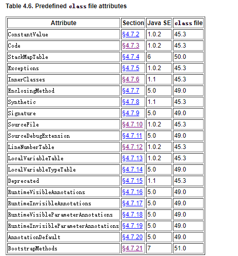

## 结构
```cpp
ClassFile {
    u4             magic;
    u2             minor_version;
    u2             major_version;

    u2             constant_pool_count;
    cp_info        constant_pool[constant_pool_count-1];

    u2             access_flags;
    u2             this_class;
    u2             super_class;

    u2             interfaces_count;
    u2             interfaces[interfaces_count];

    u2             fields_count;
    field_info     fields[fields_count];

    u2             methods_count;
    method_info    methods[methods_count];

    u2             attributes_count;
    attribute_info attributes[attributes_count];
}
```
其中常量池里包含了大量这个类中所使用的字符串常量、数字常量等。有些常量来自于代码中的硬编码，如`println(10.33, "sss")`，其中便会有对应的基本类型常量。对于`0, 1, 2`等很小的数字，会有对应字节码如`iconst_0`等支持，此时不会进入常量池。此外常量池还有大量关于类的全量限定名、方法名、类型名、方法参数等等描述，均由更基本的常量值组成。

对于方法的具体代码逻辑，是在上述的`methods`结构中，`methods`数组元素结构定义如下：

```cpp
method_info {
    u2             access_flags;
    u2             name_index;
    u2             descriptor_index;
    u2             attributes_count;
    attribute_info attributes[attributes_count];
}
```
而代码是其中`attributes`数组中的元素。预定义的包含如下类型：



里面能看到很多java方法中的信息分类。

## Lambda

Java的Lambda表达式的工作原理更为复杂。可以从另一个角度来方便理解。Java的lambda表达式，虽然看起来类似一种匿名内部类的语法糖，但实际上完全不同，但又有几分相似：

- 匿名内部类是编译时生成，而lambda只会生成出一个在原始类中新增的一个静态方法、或成员方法，此方法内容即是lambda表达式内部的代码块，而方法的参数即是lambda的参数列表。
- 在调用点，对匿名内部类来说会使用`invokeSpecial`来构造对象。而lambda情况下则是`invokeDynamic`，而其方法符号是`class`文件中的`bootstrap methods`类型属性，它一般是通过`invokestatic java.lang.invoke.LambdaMetafactory.metafactory`来在代码运行时构造出匿名类。其代码实现是：
```java
public static CallSite metafactory(MethodHandles.Lookup caller,
                                       String invokedName,
                                       MethodType invokedType,
                                       MethodType samMethodType,
                                       MethodHandle implMethod,
                                       MethodType instantiatedMethodType)
            throws LambdaConversionException {
        AbstractValidatingLambdaMetafactory mf;
        mf = new InnerClassLambdaMetafactory(caller, invokedType,
                                             invokedName, samMethodType,
                                             implMethod, instantiatedMethodType,
                                             false, EMPTY_CLASS_ARRAY, EMPTY_MT_ARRAY);
        mf.validateMetafactoryArgs();
        return mf.buildCallSite();
}

// InnerClassLambdaMetafactory已精简
CallSite buildCallSite() throws LambdaConversionException {
    final Class<?> innerClass = spinInnerClass();
    if (invokedType.parameterCount() == 0) {
        final Constructor[] ctrs = AccessController.doPrivileged(
                new PrivilegedAction<Constructor[]>() {
            @Override
            public Constructor[] run() {
                Constructor<?>[] ctrs = innerClass.getDeclaredConstructors();
                if (ctrs.length == 1) {
                    // The lambda implementing inner class constructor is private, set
                    // it accessible (by us) before creating the constant sole instance
                    ctrs[0].setAccessible(true);
                }
                return ctrs;
            }
                });
            Object inst = ctrs[0].newInstance();
            return new ConstantCallSite(MethodHandles.constant(samBase, inst));
    } else {
            UNSAFE.ensureClassInitialized(innerClass);
            return new ConstantCallSite(
                    MethodHandles.Lookup.IMPL_LOOKUP
                            .findStatic(innerClass, NAME_FACTORY, invokedType));
    }
}

private Class<?> spinInnerClass() throws LambdaConversionException {
    ...
    return UNSAFE.defineAnonymousClass(targetClass, classBytes, null);
}
```
在运行时，动态生成的匿名类则需要一些技巧才能获得。具体细节请参阅拓展阅读链接。

由此我们可以对比匿名内部类和Lambda，不难发现Lambda比匿名内部类更轻量高效。此外也不难理解为何它在调试时经常无法访问到一些外部类（包含此Lambda表达式）中的成员了，而在匿名类的情况下是可以看到的。

> Java的Lambda的实现方式和Kotlin有所不同。关于Kotlin的Lambda请参阅“kotlin”section.

## 拓展阅读

- [java lambda deep dive medium](https://medium.com/@jpwang/deep-dive-into-java-lambda-0x02-a7cf51e1f0ed)