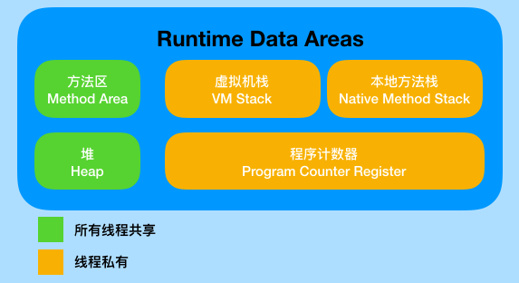

# JVM内存模型

一般而言会划分如下几类：

- 堆
- 方法区（算堆的一部分，但是存的是静态的资源，运行时常量池）
- 程序计数器（线程私有）
- 栈（线程私有）
- 本地方法栈（线程私有）

如下是更详细的对照图示

Jvm的各区名称和对应的内存

## 栈帧、方法调用

在栈上，每一个方法调用都会伴随着栈帧的产生。关于aload, astore, invokevirtual等指令具体含义，可以参考[JVM specification](https://docs.oracle.com/javase/specs/jvms/se8/html/index.html)上关于instruction的介绍。

## 对象头

