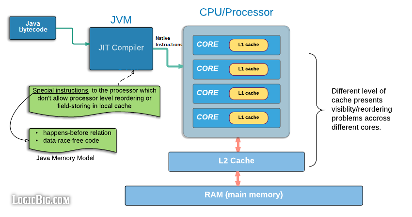
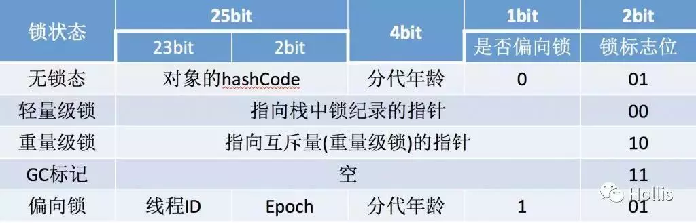

# Java并发

## volatile

它作为关键字用于修饰字段。

1. 禁止指令重排
2. 保证可见性，即使该变量cpu缓存无效。
3. 后来发现应该再增加一点，volatile还保证了double, long写入时的原子性。否则double, long可能会出现“字断裂”的情况。因为64位需要分两次写入，而这两次写入对某些平台不是原子性的。

仅适用于多线程读，固定唯一线程写的场景。

对CPU禁止缓存、禁止指令重排的简单图示。



## synchronized

它作为关键字修饰静态方法、方法，或者修饰对象来创建同步代码块。synchronized同步代码块是通过加入字节码`monitorenter`和`monitorexit`指令来实现monitor的获取和释放，也就是需要JVM通过字节码显式的去获取和释放monitor实现同步，而synchronized修饰方法的时候，是检查方法的`ACC_SYNCHRONIZED`标志，如果设置了则线程需要先去获取monitor，执行完毕了线程再释放monitor。

synchronized 的优化（无锁、偏向锁、轻量锁、重量锁）以及JVM上的实现原理（对象头），详细说明见[OpenJDK wiki](https://wiki.openjdk.java.net/display/HotSpot/Synchronization)



更多说明见[link](https://ddnd.cn/2019/03/22/java-synchronized-2/)，个人对JVM如何实现此关键字具体细节不是很大。只需要大致了解这几个锁等级含义分别是：

- 偏向锁，类似记录一下，如果整体期间就一个线程访问，则不需要任何锁升级，这种情况下，即锁倾向于当前线程。
- 轻量级锁，即自旋锁
- 重量级锁，靠mutex

## wait notify notifyAll

一定要先持有这个对象的锁，然后才可以调用这些方法。也就是一定要在`synchronized`此对象中调用。并且需要等notify的线程退出自己的`synchronized`块。

`wait`会释放掉`synchronized`持有的锁。`synchronized`是可以重入的。

`notifyAll`和`notify`区别在于，前者会唤醒所有对该对象调用`wait`的线程（当然线程们还是需要一个一个恢复执行），但是最终都会被恢复。而后者仅唤醒一个线程恢复执行。对于互斥操作情况下一般使用后者`notify`，对于可以共享操作的情况下，可以使用前者`notifyAll`（[更多说明](https://stackoverflow.com/a/37046/8154045)）。


## thread

### join

Thread内部有一个object作为lock，在线程结束时，会自动调用`lock.notifyAll()`，来唤醒所有`lock.wait`阻塞的线程。

### ThreadLocal

- thead{threadLocalMap}
- ThreadLocalMap(ThreadLocal -> Object)
- looper(sLooper(mainLooper), sThreadLocal = ThreadLocal()(用于myLooper的返回（即当前线程的looper）->sThreadLocal.get()-> Thread.threadLocalMap.get(sThreadLocal)->object)

## 原子库、CAS

Atomic原子库主要使用Unsafe包的cas操作。

## ReentrantLock ReentrantReadWriteLock CountDownLatch

都是基于AQS。AQS是通过int来维护状态的同步器基类，支持两种方式工作（但一般只选择一种，独占模式、共享模式），独占模式是state=0表示空闲，占有的时候一般会+1，共享模式是state>0表示空闲，占有的时候通过-acquire。AQS的子类需要选择性复写`tryAcquire`, `tryAcquireShared`, `tryRelease`, `tryReleaseShared`等方法，它们分别对应着上述两种模式。可以根据需要选择一种模式的相关方法复写。

`ReentrantLock`, `ReentrantReadWriteLock`都包含了公平、非公平的实现。后者和前者相比，细分了`read, write`两种情况。读-读可共存，其他情况均需要竞争、等待。

公平和非公平是指，该所的等待者是根据等待的顺序依次唤醒，还是直接竞争，随机唤醒。它们的实现差异主要在于：

- 非公平，在`tryAcquire`的时候，检查state空闲，就会acquire(即compareAndSetState)。
- 公平，在`tryAcquire`的时候，检查state空闲，如果自己的线程不是在等待队列的head的话，会返回false。如果等待队列为空的话，则也会尝试acquire。或者自己已经是占有线程了直接acquire。

## 线程池

`ThreadPoolExecutor`使用了`ArrayBlockingQueue`作为任务队列，它支持阻塞、超时、立即返回等形式的读写，并多线程安全，详见“Java”section。 `ScheduledThreadPoolExecutor`继承了`ThreadPoolExecutor`，但使用了`DelayedWorkQueue`作为任务队列，它是专门的一个实现，并不通用，如你所想，它在入列时会提供根据`delay`大小排序，似乎是堆排序。此外在出列时，获取头元素后，若发现依然有`delay`则不返回元素。即它出列的前提是该元素已经没有`delay`了。其`delay`计算的实现如下：
```java
        public long getDelay(TimeUnit unit) {
            return unit.convert(this.time - System.nanoTime(), TimeUnit.NANOSECONDS);
        }
```
`DelayedWorkQueue`出列逻辑如下：
```java
  public RunnableScheduledFuture<?> take() throws InterruptedException {
      final ReentrantLock lock = this.lock;
      lock.lockInterruptibly();
      try {
          for (;;) {
              RunnableScheduledFuture<?> first = queue[0];
              if (first == null)
                  available.await(); 
              else {
                  long delay = first.getDelay(NANOSECONDS);
                  if (delay <= 0L)  // 即若delay过期，则取出。
                      return finishPoll(first);
                  first = null; // don't retain ref while waiting
                  if (leader != null)
                      available.await();
                  else {
                      Thread thisThread = Thread.currentThread();
                      leader = thisThread;
                          available.awaitNanos(delay);
                  }
              }
          }
      }
  }
```

## 线程安全集合

参见“Java”section集合相关。

## AQS Lock Condition

### Condition

注释给的讲解很详细，先阅读一下：

Condition将Object监视器方法（ wait 、 notify和notifyAll ）分解为不同的对象，通过将它们与任意Lock实现的使用相结合，产生每个对象具有多个等待集的效果。 Lock代替了synchronized方法和语句的使用，而Condition代替了对象监视器方法的使用。
条件（也称为条件队列或条件变量）为一个线程提供了一种挂起执行（“等待”）的方法，直到另一个线程通知某个状态条件现在可能为真。 因为对这个共享状态信息的访问发生在不同的线程中，它必须受到保护，所以某种形式的锁与条件相关联。 等待条件提供的关键属性是它以原子方式释放关联的锁并挂起当前线程，就像Object.wait一样。
Condition实例本质上绑定到锁。 要获取特定Lock实例的Condition实例，请使用其newCondition()方法。
例如，假设我们有一个支持put和take方法的有界缓冲区。 如果take尝试对一个空的缓冲器，则该线程将阻塞，直到一个项目变为可用; 如果put试图在一个完整的缓冲区，那么线程将阻塞，直到空间变得可用。 我们愿继续等待put线，并take线程独立的等待集，这样我们就可以使用的只有在当项目或空间的缓冲区变得可用时通知单个线程的优化。 这可以使用两个Condition实例来实现。
   class BoundedBuffer {
     final Lock lock = new ReentrantLock();
     final Condition notFull  = lock.newCondition(); 
     final Condition notEmpty = lock.newCondition(); 
  
     final Object[] items = new Object[100];
     int putptr, takeptr, count;
  
     public void put(Object x) throws InterruptedException {
       lock.lock();
       try {
         while (count == items.length)
           notFull.await();
         items[putptr] = x;
         if (++putptr == items.length) putptr = 0;
         ++count;
         notEmpty.signal();
       } finally {
         lock.unlock();
       }
     }
  
     public Object take() throws InterruptedException {
       lock.lock();
       try {
         while (count == 0)
           notEmpty.await();
         Object x = items[takeptr];
         if (++takeptr == items.length) takeptr = 0;
         --count;
         notFull.signal();
         return x;
       } finally {
         lock.unlock();
       }
     }
   }
   
（ java.util.concurrent.ArrayBlockingQueue类提供了这个功能，所以没有理由实现这个示例使用类。）
Condition实现可以提供与Object监视器方法不同的行为和语义，例如保证通知的顺序，或者在执行通知时不需要持有锁。 如果实现提供了这样的专门语义，那么实现必须记录这些语义。
请注意， Condition实例只是普通对象，它们本身可以用作synchronized语句中的目标，并且可以调用它们自己的监视器wait和notify方法。 获取Condition实例的监视器锁，或使用其监视器方法，与获取与该Condition关联的Lock或其等待和信号方法的使用没有特定的关系。 建议您不要以这种方式使用Condition实例以避免混淆，除非在它们自己的实现中。

如上，它提供了一组`await`, `await(timeout)`, `signal`, `signalAll`等接口来提供类似`Object.java`的`wait`, `wait(timeout)`, `notify`, `notifyAll`。这两者差异在于，condition需要结合`lock`类来用，而lock类往往相比`synchronized`关键字有更灵活的api，比如`tryLock`等。

### AQS

即`AbstractQueuedSynchronizer`，它通过链表结构维护了等待队列，它的内部类`ConditionObject`是`Condition`的实现，而`Condition`也就只有这个实现。来看下它的`await`实现：
```java
public final long awaitNanos(long nanosTimeout)
        throws InterruptedException {
    Node node = addConditionWaiter();
    int savedState = fullyRelease(node);
        if (nanosTimeout > SPIN_FOR_TIMEOUT_THRESHOLD)
            LockSupport.parkNanos(this, nanosTimeout);
    }
}
```
在我来看主要的代码精简如上，即添加一个等待节点（以便唤起），使用`LockSupport`来`park`一个超时时长，这里会调用到`Unsafe`包的`park`来挂起线程一段时间。


## Unsafe

这个类很神秘，但又经常在底层的代码中遇到。虽然叫Unsafe，但是Jdk不少部分功能依然依赖于此，尤其是和并发相关的功能。这个类的目的是由jdk来实现平台相关的一组api，这组api往往在不同平台上有不同的cpu指令集的支持，由此可以获得更好的并发原语支持。比如CAS操作，park, unpark等。若平台没有特定的支持方式，则可以用普通代码兜底实现。

## 拓展阅读

- [Java并发概述](http://tutorials.jenkov.com/java-concurrency/thread-signaling.html)
