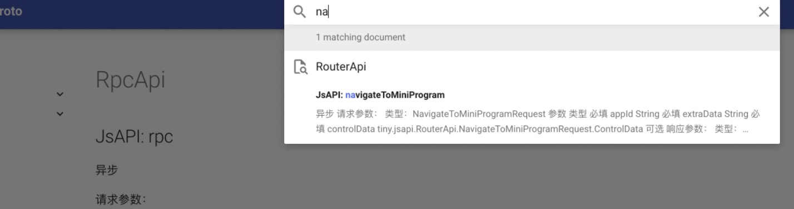

# JsApi Proto

用`proto`语法描述容器注入的JsApi，并生成出各语言的client/service实现。

本文假设您已经对[`proto2`/`proto3`](https://developers.google.com/protocol-buffers/docs/proto3)有所了解。

特点：

- `proto`语言中立，对此类桥接性质的JsApi，可以生成出各种语言版本的 Api使用端/实现端。
- 中间过程的序列化/反序列化自动处理，支持Json和protobuf等多种方式。
- 面向对象友好，关注具体的数据结构定义，而不必对零散字段手动处理。
- 文档友好，结合`proto`的注释，可以输出JsApi文档，以便后续的加工处理。比如对内、对外文档生成等。见“文档生成”章节。

样例：

此仓库的`example`目录包含了JsApi proto样例以及生成的ts, java代码样例。


## JsApi 描述

我们使用proto中的`service`相关语法来描述JsApi，和描述一个`rpc`方法十分相似，尽管它本质上并不是rpc。

下面的代码定义了一个异步JsApi。
```proto
syntax = "proto3";

message Request {
  string action = 1;
  int32 id = 2;
}

message Response {
  string message = 1;
  bool isSuccess = 2;
}

service DemoApiInterface {
  rpc asyncApi(Request) returns (Response) {}
}
```
如你所见，这段proto描述了一个JsApi，它是异步的，客户端需要传入`Request`对象，服务端需要返回`Response`。在我们的场景中，客户端是指小程序侧，服务端则是小程序容器侧。我们根据场景补充了如下自定义的选项和类型：

|拓展|含义|默认值|
|---|---|---|
|isAsync|表示JsApi是否是异步|true|
|isEvent|表示是否是从小程序容器侧调用至小程序侧，一般是事件场景，在方法返回类型中定义事件数据结构。|false|
|Void|当不需要请求参数，或者不需要返回结果，用此占位。||
|androidOnly|表示仅限安卓||
|windowsOnly|表示仅限Windows||


注意，当使用到`isAsync`, `isEvent`, `Void`时，我们推荐使用`import "rocket.proto";`的方式来导入这些选项、类型的定义。`rocket.proto`可以在`example`目录下找到。

下面通过给方法配置`isAsync`字段为`false`来改变JsApi为同步形式。
```
rpc syncApi(Request) returns (Response) { option (isAsync) = false; }
```
而对于从小程序容器侧主动调用到小程序侧的JsApi，需要`isEvent`字段设为true。在返回结果中传入数据体定义。
```
rpc onSomeEvent(Void) returns (Response) { option (isEvent) = true; }
```
此外，如果不需要任何请求参数，或者不需要任何返回结果，则将对应类型用`Void`代替。
```
rpc asyncApiNoParamNoResponse(Void) returns (Void) {}
```

除了上述的自定义拓展，我们还支持如下的`proto`特性：
- optional字段
- 枚举类型
- 嵌套类型
- repeated字段

使用这些特性可以有效帮助定义JsApi的数据结构。比如：

```
message SomeActionRequest {
  Action action = 1;

  enum Action {
    Play = 0;
    Pause = 1;
    Stop = 2;
  }
}

message SomeActionResponse {
  optional PlayActionResult playActionResult = 1;
  optional PauseActionResult pauseActionResult = 2;
}
```

## 代码生成

### protoc-rocket工具

[`protoc-rocket`工具](https://code.alipay.com/zhangruize.zrz/protoc-rocket)是一个方便为JsApi proto生成`.ts`, `.java`文件的工具。它内置了`protoc`，并会自行下载最新的ts/java插件，只需要一句命令即可生成所需的文件。

在安装nodejs环境后，安装tnpm（若已有tnpm则跳过）：
```shell
npm install tnpm -g --registry=https://registry.npm.alibaba-inc.com
```
安装`protoc-rocket`:
```shell
tnpm install -g @alipay/protoc-rocket
```
之后即可开始使用`protoc-rocket`了。了解更多背后细节，请[查阅仓库](https://code.alipay.com/zhangruize.zrz/protoc-rocket)。

## 在工程中使用

### Rocket小程序

首先要为Rocket小程序配置typescript环境，建议安装全局的typescript（如果已有请跳过）：
```shell
npm install -g typescript
```

创建页面的ts文件`your-page.ts`并将`your-page.vue`中script部分由前者导入，比如：
```js
<template>
  <div class="page home-page">
    <text>{{ content }}</text>
  </div>
</template>

<script>
export default your-page.default; //完全交给.ts输出的独立.js文件导入
</script>
```
同时在`manifest.json`中对该页面增加`import`配置，由此在typescript编译后得到页面的独立`.js`文件并被`.vue`文件导入。
```json
  "pages": [
    {
      "key": "...",
      "index": "./pages/home/your-page",
      "imports": [
        {
          "alias": "your-page",
          "path": "./pages/home/your-page.js"
        }
      ]
    }
  ]
```
此时小程序工程具备了typescript环境。接着直接使用`protoc-rocket`工具即可生成`.ts`文件到目标工程：
```
protoc-rocket path/to/proto -I=path/to/proto_folder --ts_out=project/src/jsapi
```
为了方便，还可以把这个命令添加到`package.json`中方便使用：
```json
{
   "scripts": {
    ...
    "protoc:ts": "protoc-rocket jsapi/proto/local/path -I=jsapi/proto/local/folder --ts_out=src/api"
  } 
}
```


如果仍然有困惑，可以参考样板工程：[example-proto2ts-rocket-miniapp](https://code.alipay.com/zhangruize.zrz/example-proto2ts-rocket-miniapp)

### Java工程

在Gradle工程中，推荐使用`protobuf-gradle-plugin`插件。再配置下Java插件路径，添加JsApi proto路径到proto sourceSet即可。模块build.gradle配置参考如下：
```groovy
Properties properties = new Properties()
properties.load(project.rootProject.file('local.properties').newDataInputStream())

android {
    sourceSets {
        main {
            proto {
                // In addition to the default 'src/main/proto'
                def jsapiProtoPath = properties.getProperty("jsapi.proto.dir")
                if (jsapiProtoPath != null && !jsapiProtoPath.isEmpty()) {
                    srcDir jsapiProtoPath
                }
            }
        }
    }
}

protobuf {
    protoc {
        artifact = 'com.google.protobuf:protoc:3.18.0'
    }
    plugins {
        rocket {
            // use remote artifact in future. Or use your any local path.
            path = rootDir.absolutePath + '/protoc-rocket-plugin-java/lib/bin/lib'
        }
    }
    generateProtoTasks {
        all().each { task ->
            task.builtins {
                remove java
            }

            task.plugins {
                rocket {
                    option "container=tiny"
                }
            }
        }
    }
}
```

除了`protobuf-gradle-plugin`，你也可以使用`protoc-rocket`工具从JsApi proto生成`.java`文件到目标工程：
```
protoc-rocket path/to/proto -I=path/to/proto_folder java_out=project/src/main/java
```
具体路径请根据本地环境更改。

## 文档生成

JsApi proto可以轻松获取JsApi的各类信息，也包括注释信息。从而可以轻松输出JsApi文档，可以大幅方便对内、对外的查阅。如下：




## Q&A

|Question|Anwser|
|--|--|
|为何不使用protoc内置的代码生成器而要自写？|主要因为protoc内置的js/java代码生成器生成的代码量较大，且不适用于当前场景。详见`protoc-rocket-plugin-java`仓库文档。|
|有哪些缺点？|稍增加了工程复杂度、稍增加了包体积，不支持部分proto语法。暂不支持字段默认值。|
|支持C/C++吗？|需要自写一个C/C++的插件来支持。|
|和protobuf区别是什么？|目前只使用了Json序列化/反序列化。但生成代码风格和protobuf保持一致，未来若有需要，可以无缝替换到protobuf的序列化/反序列化方式。|
|调用的容器侧JsApi是泛化的还是各自单独的？|我们提供了`useGenericBridge`选项以允许在方法维度切换使用泛化容器侧接口。|

## 相关仓库

- protoc-rocket protoc-rocket 工具。
- protoc-rocket-plugin-java protoc java插件，用于输出java文件。
- protoc-rocket-plugin-ts protoc ts插件，用于输出ts文件。
- example-proto2ts-rocket-miniapp 包含了typescript和JsApi proto生成的小程序样板工程。
