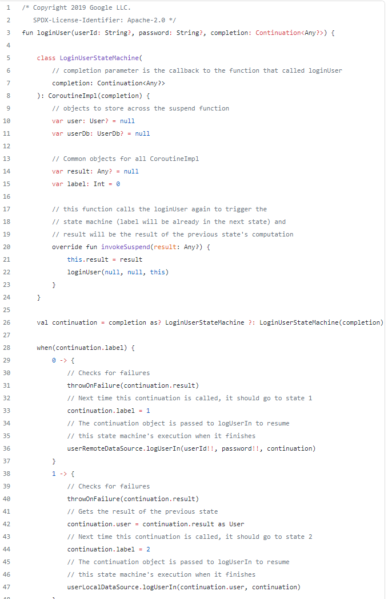

本文将介绍Kotlin中协程有关的基本概念、以及挂起函数的工作原理。

## 背景

协程在kotlin中以官方的库出现，需要配合suspend关键词。而suspend因为只是语法的一部分，意味着至于suspend的具体实现，还有更大的弹性，不一定就要和协程一直绑定。suspend关键词类比Javascript的async/await，Continuation(稍后会说)类比Javascript的Promise，它们的出现，主要都是为了解决以前的编程语言中，对“异步”“同步”描述能力的匮乏。在这些概念出现前，“老”的编程语言中一般会以回调接口提供“异步”的编程，不断的异步回调接口实现，会引入嵌套，使得代码难看且不易于维护。

```
aAsyncAction(callback1{
    bAsyncAction(callback2{
        cAsyncAction(callback3{

        })
    })
})
```

优化的思路都是把其转为顺序调用。从一开始的响应式链式调用RxJava，类比Promise手动调用。将嵌套结构先抹平。

```
aAsyncAction()
.map({result1->
    return bAsyncAction(result)
})
.map({result2->
    return cAsyncAction(result)
}).observe()

aAsyncAction()
.then(result1 =>{
    return bAsyncAction(result1)
})
.then(result2=>{
    return cAsyncAction(result2)
}).
```
但因为样板代码也很多。所以优秀的封装进一步出现。
```
async function jsAsyncFunction(){
    let result = aAsyncFunction()
    result = bAsyncFuntion(result)
    cAsyncFunction(result)
}

suspend fun kotlinSuspendFunction(){
    val result1 = aAsyncFunction()
    val result2 = bAsyncFunction(result1)
    cAsyncFunction(result2)
}
```
进一步将其转化为看起来和“同步”一样的代码。而把样板代码的工作全交给编译器来处理。这便是suspend所带来的重要改变。
> 如果只有suspend，但没有协程库，并非没有可能让它成功运行。因为这套语法对于描述异步逻辑已经具备完整的信息。即使没有coroutine包下的所有工具，理论上讲，照样可以给它执行异步的环境，并注入普通的回调机制，来让其工作。但这好比把Kotlin的这部分编译能力重做了。

尽管如此，kotlin更进一步，在协程中增加了上下文，提供了更完善的“结构化并发”的支持，可以更方便管理作业关系。相比Javascript严格单线程可异步，Kotlin的协程在多线程的环境下面临的挑战更大，最终带给开发者的收益也更高。

## 协程是什么

抛开一些常见的说法，Coroutine是“轻量级线程”。这种说法有些容易令人困惑。以个人角度，Coroutine与过去认知的Job、Task的角色会更贴切。

类：StandaloneCoroutine: AbstractCoroutine: JobSupport(active), Job, Continuation<T>, CoroutineScope

它包含了关于作业的一些周期回调、状态、作业关系、以及协程上下文信息。当用协程构造器构造协程后，启动时，本质就是一个Job开始启动。

## 回调是什么

`Continuation`扮演者类似Javascript的Promise的角色，也就是类似回调的角色。它包含了一个协程上下文，以及`resumeWith(Result)`。这个`resumeWith`经常令我困惑。尤其当需要实现一个Continuatino的时候，实现此方法时，经常会有错觉是要传递一个结果出去，而实际上实现此方法是收到结果，即类似`onCallback(result)`,`onResult(result)`这种。只是这种名字对传入数据的调用方很好理解，比如Continuation作为入参时，说明我们需要完成一些任务，然后调用它的`resumeWith()`来传递计算结果。

## 上下文、范围

`CoroutineContext`是协程的上下文环境，协程的运行过程中可以从中找到很多约定的重要元素。而它也复写了操作符`+`，使得上下文的元素添加很方便。

`Element : CoroutineContext`上下文环境中的元素，另外有一个空接口`Key`作为键

`CoroutineScope`用于方便管理一个逻辑上下文里的任务。Android的Lifecycle库中，便提供了内置的lifecycleScope，还有ViewModelScope，都用于这些对应类（如Activity, Fragment, ViewModel, View)的生命周期内所运行的协程任务。在此范围内的任务，往往会被负责管理此范围的状态者所间接控制。除了主要的启动协程方法`launch{}` `async`一般还会提供拓展方法类似 `launchWhenCreated`, `launchWhenStart`等不同声明周期时再启动的协程。

`EmptyCoroutineContext`空的上下文

## 发起、迁移

`runBlocking`从非挂起方法环境到挂起lambda环境。阻塞线程直到lambda完成。即使使用Dispatchers，也只是代表Lambda的执行线程，但调用发起线程依然会阻塞。

`launch:Job`在挂起环境中发起一个协程，会返回Job。可指定协程启动方式，默认直接启动。是否阻塞取决于协程启动方式，如果是直接运行就会阻塞。但本意不阻塞。

`async:Deffered<T>`在挂起环境中发起一个协程，本意不阻塞，可`await`等待结果。

`withContext`在挂起环境中发起一个协程，阻塞并等待结果。但更广义上说，切换一个context环境，运行并等待结果。


`suspendCancellableCoroutine`是一个常用的把传统的回调、异步行为迁移到协程方式、也或者封装成协程方式。一个合格的封装不仅要考虑`resume`还要考虑`invokeOnCancel`等。如下是`compose`对choreographer的callback的封装：
```
suspend fun <R> withFrameNanos(
        onFrame: (Long) -> R
    ): R {
        val uiDispatcher = coroutineContext[ContinuationInterceptor] as? AndroidUiDispatcher
        return suspendCancellableCoroutine { co ->
            val callback = Choreographer.FrameCallback { frameTimeNanos ->
                co.resumeWith(runCatching { onFrame(frameTimeNanos) })
            }
            if (uiDispatcher != null && uiDispatcher.choreographer == choreographer) {
                uiDispatcher.postFrameCallback(callback)
                co.invokeOnCancellation { uiDispatcher.removeFrameCallback(callback) }
            } else {
                choreographer.postFrameCallback(callback)
                co.invokeOnCancellation { choreographer.removeFrameCallback(callback) }
            }
        }
    }

```

## 线程切换

`DispatchedContinuation(CoroutineDispatcher, Continuation):Continuation, DispatchedTask`

复写了`resumeWith`，询问dispatcher是否需要分发，若需要，则分发。

`ExecutorCoroutineDispatcher: CoroutineDispatcher`

`ExecutorCoroutineDispatcherImpl: ExecutorCoroutineDispatcher(), Delay `
一般还是用ExecuterService分发。若是ScheduledExecuterService，则delay会用其对应的`schedule`等方法，否则将开启其他线程。


## 挂起函数

`suspend fun xxx(){}`

挂起函数会被编译器处理，补充一个Continuation参数，类比此方法同步执行的结果异步回调。在函数内部，对于每个挂起方法调用处，都可以认为是一个挂起点，相比于每一个挂起点都新生成一个回调，Kotlin选择建立一个内部的类(继承于 `ContinuationImpl`，重写`invokeSuspend`)，类似有限状态机，作为这些挂起点共用的回调。并且为其字段赋值不同阶段得到的结果。因此避免产生更多无意义的回调匿名类和实例。在成功完成后，会调用参数中自动补充的continuation，作为对最终结果的回调。

所以简单来说，挂起函数、挂起方法，原理就是，其内部共用生成的一个回调，并给方法入参自动添加一个回调，在方法完成后调用。




`suspend ()->Unit`或更一般的`suspend T.()->R`

比如`runBlocking{...}`，或者`someF: suspend ()->R,    someF.createCoroutine`等情况，编译器的处理会略有不同。会生成继承于`SuspendLambda :ContinuationImpl`的子类，重写了`invokeSuspend`，`create:Continuation`，以及Function2的接口`invoke`, 其中`invoke`逻辑就是`create(.., ..).invokeSuspend`。而它和上面`suspend fun `区别在于，上面是需要为挂起方法生成一个对应的类，再在原方法中使用。而这里因为kotlin的suspend lambda本来就会转为匿名类(继承于SuspendLambda)，此时lambda所有代码直接被转移到了`invokeSuspend`方法里。

此时，我们也可以推断。在Kotlin中，挂起块转为协程的最终部分，其实都是由编译器来负责生成了`ContinuationImpl`的子类，其中关键方法`invokeSuspend`对于挂起方法和挂起Lambda表达式有所差异，前者是记录结果，并重复调用原挂起方法，从而进入下一个label。而后者是内联了lambda表达式的所有内容。 而两者代码块内容中，所有的挂起点都会被一致的方式处理，即被label标记，并共用一个，即生成的这个Continuation作为回调。直到最后的结果。

## 优劣

- 对于改用协程的库件来说，会让app总线程数量的维护得到优化，每个库不必再维护自己的线程池。

- 更精炼的异步代码、更好的生命周期范围管理。

## 特殊问题

launch{
    runblocking{
        println()
    }
}

说是会有偶现问题，会导致launch无法结束。

## 瞎掰一句

很多Kotlin的特性，至少在Jvm平台上，能看到编译器做了大量的工作。一段简短的kotlin代码，背后的Jvm class却并不简短。甚至编译器对其编译内容里，进一步引入了Kotlin的协程库，即说明，即使完成了编译，在运行时必须要附带Kotlin的协程库运行时，不然依然无法执行。

这些特点其实启发还是很多的，也和之前遇到的很多事情都很相似，具体来说：
- 语法被编译器编译到特定平台，这工作类似我们在Apt或者android gradle transform class过程，需要自动生成一些代码。也类似之前做`lx`项目。
- 编译器引入了依赖，这个类似在`lx`项目中，用了`external`关键字来引入外部能力，交给编译器去解析`id`，以此引入依赖，主要是特定平台的一些依赖。而差异在于，它引入了自己在此平台提供的一套运行时依赖。就好比对于`lx`项目，`external println=System.out.println`变成了`external println=Lx.jvm.println`。同时最终打包需要引入`Lx.jvm`包。

不妨让自己也有空想象一下，如果自己要让`lx`也来试着解决下异步语法支持问题，该给出怎样的方案呢。

## 拓展阅读

[介绍挂起函数的字节码生成](https://medium.com/androiddevelopers/the-suspend-modifier-under-the-hood-b7ce46af624f)