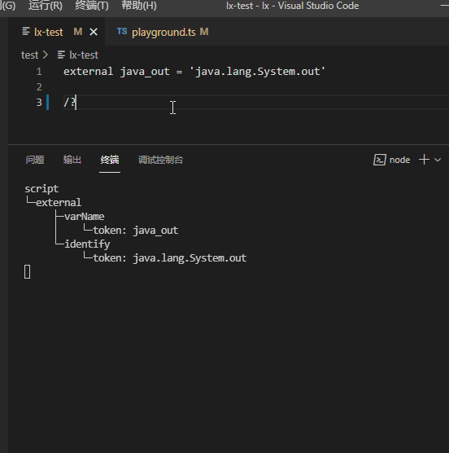
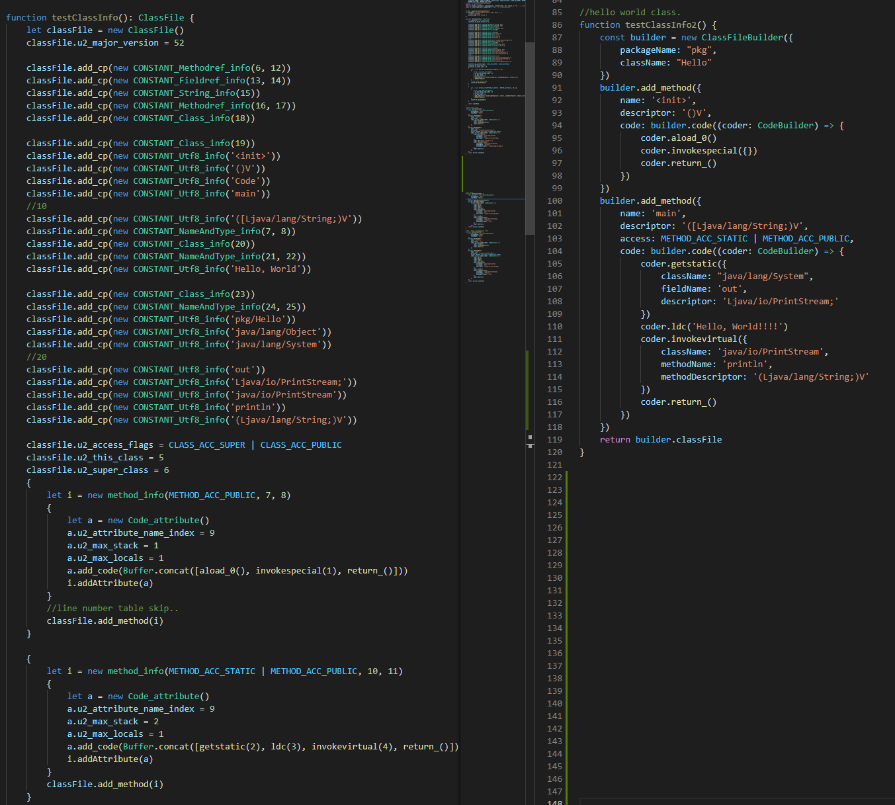

最近花了一周时间，用typescript写了一个玩具语言，包括它的语法解析器、以及一个简单的编译器，能把它编译为jvm平台的class文件并运行。整个项目没有任何外部依赖。初衷是想亲自体验一下这种创造一些最基本的东西的乐趣。***实际证明，比起单纯阅读了解，还是有条件上手尝试写一下带来的感觉才更棒~***


# 具体做了什么

- 设计了一个语言的语法
- 设计了一个用于生成语法解析器的表达式。（为了更高效的描述语法、解析语法）
- 一个class文件生成器
- 一个把语法解析树编译输出为class文件的编译器
- 一个playground，文件变更时自动解析、编译。
- 无外部依赖

# 具体细节

## 一开始

一开始本来想研究下llvm，但因为手上电脑是windows，对编译这种cpp项目感觉会有坑，就没直接尝试。但感觉这些底层的东西，如果只是为了初步跑起来，自己写一遍也会是个有趣的过程。就决定自己开始写了。

一开始是按照lexer通过nextChar类似方式，把char转为token，进而交给parser再做处理。整个过程的lexer、parser全部是针对这个语言手动编写的。比如，希望增加某个关键字时，就要在lexer里补充特定的判断，输出新的token类型，从而在后面的parser里可以判断。

补充说明一下，这里的大致工作模型是，parser->lexer.nextToken()->input.nextChar()...。lexer在生成token的流程一般是，吃掉一波连续空格，然后读取下一波连续的数字/字母或特定的符号等等，来返回一个需要被解析器处理的基本元素。

如果一门语言的语法，已经定死了、不再轻易改动了，那么这样子也无可厚非。但对于我来说，因为这些代码所想表达的东西其实会有更好的抽象形式，就像正则表达式那样，比如对于连续加法，a(+ b)*，就能表达出很多种合理的可能性。我觉得比起写死某种特定解析，还是后者这种能根据表达式自动生成解析器解析语言脚本来的更爽。

## 语法表达式、自动生成解析器

于是，在手写了两天后，意识到想给它补充新的语法规则时，是低效繁琐的，转而开始重构用“语法表达式”来自动生成解析器，并也允许注入一些手写的解析器的方案。***在两年前有了解过ALTAR4/5，似乎是这个名字，当时看到那种直接描述语法规则，就可以自动生成语法解析器的感觉令人印象深刻。我也算在手动做一个简单版本的。***

经过一段时间思考，我设计的描述语法规则的表达式如下：
```
(tag1 tag2 tag3) //tag1, tag2, tag3按顺序尝试，前一个解析成功才会尝试下一个解析器，最后一个解析器成功后则表达式解析成功
                 //也就是，这是一个逻辑 与 的表达式，在内部会把几个解析器合并为一个and解析器。
[tag1 tag2 tag3] //tag1, tag2, tag3按顺序尝试，有一个解析成功则表达式成功。
                 //也就是，这是一个逻辑 或 的表达式，内部会把它们合并为一个or解析器
tag*            //匹配成功次数下限0，无上限。此表达式总是成功。
tag+            //匹配成功次数下限1，无上限。
tag?            //匹配成功次数下限0，上限1
!tag            //若tag解析成功，则此表达式解析失败，若tag解析失败，则此表达式解析成功。
"str"           //为固定字符串生成内容匹配解析器，完全和str相同时解析成功。
                //注意，它也可以作为tag替换到上面的表达式中
tag1 tag2 tag3  //无括号时，等于(tag1 tag2 tag3)
```
在设计这套表达式的时候，所需的特性也是取自之前手写解析器的经验。特性可以简单归纳如下：
- 逻辑and和or、逻辑否定
- 匹配次数限制
- 可嵌套使用
- 纯字符串匹配
在满足这些能力的表达诉求后，我觉得已经能满足很多情况使用了。自己设计完之后尝试写了几个规则，感到满意、轻松、没有歧义就足够了。接下来就是写程序来处理它了。

处理这套表达式的思路也很有趣且简单，就是把上面定义，都理解为对解析器的一次包装，从而得到一个新的解析器。因此整个表达式最终返回的也是一个解析器。其实这个思路是得益于一个前提：***对解析器的统一抽象，对解析结果的统一抽象***。

这里包括的抽象模型是：
- Node:{name:string, nodes:Node[]}
- Parser(LexerContext):Node|undefined
- LexerContext{ nextChar(); pos():number; seek(number); }

对解析器的包装能力包括：
- and(Parser[]):Parser => Node result, while((node=parser[i](context) && result.nodes.push(n)))...
- or(Parser[]):Parser => while(n = parser[i](context)) return n....
- mc(Parser, minMatchCount, maxMatchCount):Parser
- neg(Parser):Parser
- contentParser(str):Parser

到此，已经可以编写出解析这套语法表达式的解析器了。并让它能生成新的解析器，和某个tag绑定注册起来。当然，在真正开始使用它表达一些上层语法前，还需要更基本的解析器，它们充当着lexer把char转为token的角色。比如：
- registerParser('0-9', myDigitParser)
- registerParser('A-z', myAlphaParser)
- registerParser('wsc', myWhiteSpaceConsumer)
- registerParser('br', myLineBreakParser)
- registerParser('eof', myEofParser)
借助我们的tag注册机制，不仅可以注册生成的解析器，也可以注册自己手写的解析器。它们共享着一个Context。也就是，当有一个解析器解析成功后，context的位置信息会更新，所有的解析器都能按顺序在一个上下文工作。

最后还需要提一下，这个方式会遇到“空格”、“换行”消费的问题。和文章一开始的工作模型不同，如果我用表达式(varName "." functionName "()")来试图表达空参数函数调用的情况时，"   someVar  .  afun  ()  "将无法被解析成功。这里有诸多原因。但为了和之前的工作方式接近，我添加了一个默认原则，自动生成的解析器会“吃掉连续空白”后再开始真正工作。这样的话，意味着如下的情况：
```
语法表达式： (varName "." functionName "()")。varName和functionName都是自动生成的解析器。
无法匹配："   someVar  .  afun  ()  "。因为someVar后面的空白无法被表达式里的"."处理

registerParser("dot",'"."')
语法表达式： (varName dot functionName "()")
无法匹配："   someVar  .  afun  ()  "。因为afun后面的空白无法被表达式里的"()"处理

registerParser("lb",'"("')
registerParser("rb",'")"')
语法表达式： (varName dot functionName lb rb)
可以匹配："   someVar  .  afun  ()  "。但并非完全匹配，匹配后context处于)之后。下个解析器依然要注意空白处理。
```

对于换行和eof的处理，我是都在script的解析器中处理。而并没有写在类似表达式的语法规则里。

## 定义语法，优化解析器结果，生成解析树

如果一切顺利，现在终于可以比较高效地定义语法规则了。玩了一会，很快就会意识到接下来的问题：这解析结果有点复杂啊。

因为上面的设计，我们对表达式里的最基本元素进行了层层封装，每一次封装，都可能会带来一个新的节点层级，最后导致语法虽然匹配顺利，但得到的解析结果很繁琐。对此，我所采取的优化方式是，增加一个优化返回结果的解析器封装。或者自定义一个解析器封装，用于在拿到结果后把里面的结构梳理好。 目前这个方式还比较“手动”，我其实一直在想另一种把解析结果的层级结构也融入到语法表达式定义中。但因为可能的诉求太多，还没精力去真正思考其可行性。初步想法类似(lb paramList rb){paramList}{"args"}，表达的含义是把只保留解析结果里的paramList结构，并重命名为args。但看起来还是有诸多问题。因此还是先手动来优化了。

手动优化解析结果时，其实就是关于节点树的各种操作，为了方便，抽象出了节点操作包括：
- merge，把所有的节点递归遍历后，把内部的token合并。最后得到一个Token作为结果，适合一些不需要保留解析细节的规则。
- 删除
- 打平（层级提升）
- 重命名
- Visit，它的主要目的其实就是提供一个通用递归访问器。此外有时候也会为了操作方便，会靠visit收集出节点列表，然后重新创建自己需要的节点结构来完全替换解析结果。

当编写“二目运算表达式”的时候，会遇到一些挑战，当然也是在之前一开始手写Parser的时候就遇到过。因为运算符优先级的问题，需要更复杂的逻辑来调整解析结果。一般会把更高优的构建成一个子树，添加到上层的左运算数或右运算数里。度过这个挑战、充分测试、得到满意的结果、可能会花费2-6个小时不等。

> 一开始我考虑的比较简单，写耳目运算符表达式只是为了求+-/*，运算符优先级也是为了满足这几个符号的优先级。后来发觉，它的用处还有很多。包括很多二目逻辑运算符，== != && || >= <= > < 等等。这些运算符的支持都依然会受益于这个逻辑。

如果一切顺利，此时，我们应该可以得到很多不错的、测试良好的“表达式”语法了。现在只需要再写一个类似“script”解析器，类似代码块解析器，类比一个语法集合，来用它作为最外层的解析器，来解析一个脚本文件里的所有内容了。这里唯一可能头疼的就是换行和文件结尾的问题。我花了有2-3个小时尝试了一些方式解决。这些解决方式都并没有打破上面的基本原则。而是在这些规则内的巧妙手段来解决，依然满足原则的简单性。

此时，在完成这些之后，就能解析一段自己语言的脚本了。检查下它的解析结果，思考下是否需要优化。如果还有兴趣，把解析结果以更有趣的方式打印出来以便观察吧。

## 优化报错，写一个playground

无法被解析是很常见的事，这个时候context中会有不少关键信息可以提供。可以把出错的内容位置和上下文罗列清楚，以便我们知道是哪里没能解析。

之后我打开了一个之前一直本用作测试自定义脚本输入源的文件，用Node fs的watch对它持续观察，然后解析，输出解析结果，亦或给出报错详细信息。这样子，在VS Code里，就得到了一个有趣的Playground了。我录了一个动图：



## 让它跑起来，classFileBuilder

到了这一步，我们拿到了自己语言的语法树。还差一步才能让它真正被计算机运行。这里我考虑了多种方式：
- 翻译成某些语言，如JavaScript、Java
- 迁移至某些更通用的AST，以借助相应AST的工具生态。
- 解释执行，写一个解释器，用自己的解释器运行自己的脚本。
- 编译到平台，编译到某个特定平台，比如jvm。native的平台就不太敢想了，除非用llvm。不然工作量应该是惊人的，或者也是我目前不擅长的。

其实还有一种方式，写一个虚拟机，不过这个还是留给未来吧（为什么要写一个虚拟机？因为感觉比起一味去理解jvm的种种东西，不如自己写一个简单的去意识到要面临哪些问题，以及大概怎么解决）。

是的，能想到这些有趣的方式，也是做这件事给我的巨大乐趣哈哈。

那么该怎么选择呢。
- 方式1，我觉得有点无聊。或许有机会可以研究下babel.js，但总之还是偏无聊。把自己的东西翻译到一个自己熟悉的语言，听上去收获很少、挑战一般。
- 方式2：AST转换。是我了解不多的领域，会有收获。但转AST应该令我头疼。毕竟，AST和自己的语法设计还是挺紧密的。
- 方式3：不错，早就知道JIT了，但了解一直不够深刻，值得自己写一下试试。（未来搞）
- 方式4：我选了编译到jvm。主要是想加深下对class文件的印象。毕竟自己之前做安卓比较久。对class文件印象再深一些还是有意义的。

过程也是比较顺利。其实就是把jvm specification打开，第四章，class文件结构。第二章，查指令。把里面的一部分东西翻译出来就行了。精力有限，只翻译了自己关心的。

我先javac -g:none Hello.java编译了一个不带调试信息的Hello world（一开始没注意，调试信息有点拖开发节奏，着急的话，就去掉吧）。
拿到Hello.class后可以对照javap的结果，并用二进制查看器、辅以Jvm Specification第四章，边读边理解。然后编码翻译。

我先靠此过程输出了一个class_file的结构定义，包括里面主要的结构定义。然后靠这些结构定义，照着javap Hello.class的内容手动硬生生组装出一个class文件。然后用二进制diff工具一点点对比，修复所有问题后。再进一步提炼一些方法，来简化class_file的结构生成、以及code属性的生成过程。

经过一些努力，得到了ClassFileBuilder，和CodeBuilder。通过这两个类的api。就可以在比较短的描述下，构建出Hello World的class文件了。当然除了Hello World，还可以根据自己需要，逐渐使用更复杂的java文件，增加更复杂的class文件支持。

如下图是对比靠手动组装class_file结构，和使用封装后的classFileBuilder的差异：



这个过程中，主要就是在更改一些后，时不时测试一下保证得到的class文件能被javap解析，能java跑通，输出符合预期的结果。


## 写Compiler 

现在只需要关注如何把解析出来的语法树，转为合适的classFileBuilder的使用了。亦或者说，核心是，遍历Node节点并转为合适的Builder调用。***或许这不算严格的compiler定义，但处于简单场景，此时需要它来扮演这个角色***

我的设计是，对每个节点都应该有一个对应的节点处理器。节点处理器之间基本共享一个上下文，从上下文中获得codeBuilder的api、以及其他信息，比如变量表等。这些处理器，有的工作会复杂一些，有的则简单一些，甚至什么都不做，比如对于“注释”类型的节点，就什么都不做（哦，当然我们不会考虑类似输出doc这种复杂的功能，对于class生成来说它确实不需要关注）。

因为我的最外层节点是script，所以这个流程入口基本就是，找到script的节点处理器，开始处理script节点。script节点处理器会负责基于输入的context，创建新的context，定义className, packageName,做一些classFile的设定，添加空构造、主方法，然后遍历子节点，注入新创建的context，子节点的处理器们从context里拿到的codeBuilder就是script对应构造的classFile的了。

节点处理器做的事情大概是：
- “声明”节点处理器：记录变量名，变量类型
- “外部声明”节点处理器：记录变量名，解析外部Id。
- “赋值”节点处理器：先让右侧表达式自行处理（值表达式处理），然后处理左表达式（变量名），获取变量索引、类型，xstore
- “值表达式”节点处理器：子节点自行解析
- “变量名”节点处理器：查询上下文变量表有无此变量，获取类型信息，或许变量索引，xload
- “数字”节点处理器：ldc
- “字面量”节点处理器：ldc
- “二目运算”：左侧节点自行处理、右侧节点自行处理，无脑 iadd/isub....etc。目前没考虑更复杂情况、也没考虑类型问题
- “方法调用”：有些复杂，有callee则先解析callee，然后准备参数列表（子节点自行处理），然后解析方法名，因为基本都是走external方法，即java的方法，会涉及方法重载，这个时候不得不检查参数类型和方法签名中的类型匹配了。

综上，其实会意识到，compiler是一个非常复杂的部分。对我而言，感到困难的地方在于：
- 类型解析、比对。因为转为具体的jvm instruction的时候，很多指令是需要区分i/a/f/d/s等的，对应不同的类型。这种情况下没有魔法，只能去选择准确的类型来调用。
- 方法匹配。要转为Java的具体方法时，涉及到方法重载，需要对方法签名的参数和Compiler中解析的类型做对比。选择一个合适的方法签名来调用。

当解决之后，这个编译器至少会报出两类常见的主要错误：
- 使用了未声明的变量名
- 无法找到合适的方法

这一切还是没有涉及到“条件”“循环”“方法声明”的。更没有高级的“接口”“类”“类型参数”等等。

因为我做的比较粗糙，以至于有很多错误在编译器都没检查，需要自行保证，不然会运行时遇到一些“酷炫”的错误。之所以说它“酷炫”是因为，这些错误，平时直接写Java/kotlin时似乎是没看到过的。前者主要是jvm instruction调用失败、出现错误了。而后者往往是主动抛出的异常，在jvm instruction执行层面上并没有问题。

> 一开始设计语法的时候，并没有考虑类型声明，是写编译器这个环节发现没有类型信息实在太难推断出类型、从而无法确定合适的jvm instruction。所以赶紧补上了只认一种类型：int。

## 结合Playground，大功告成

加上我们的playground，我们在文件变更时，语法解析成功后，交给compiler，如果compiler也成功编译，边给出一句cmd指令以便我们运行输出的class程序。如果compiler编译失败，那么我们也可以看到一些非常简单的错误。当然还有更多错误在运行输出的class文件里。这种时候，需要我们看看输出class文件时，究竟写了哪些指令。得益于Javascript的Object.prototype，我们给builder写入指令的时候包装了log。从而可以更方便的诊断问题。

综上，就是这一周时间的有趣旅程，亲手写这些基础的东西收获很多，但感觉如果在更早的时候，比如大学本科去完成似乎就更好了。

附上一张图片结束这个短暂的旅程吧。

