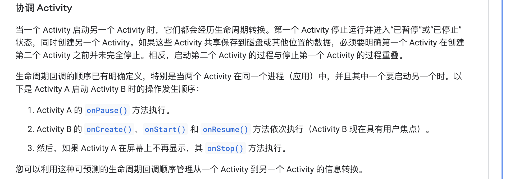

# 快速笔记

# activity

## mvc, mvp, mvvm
首先，不使用这些框架，一般会遇到难以维护、难以拓展、难以测试的问题


MVC

View提供基本功能接口，UI事件由View感知，调用controller响应并由controller找Model获取数据。model获取数据之后告知controller（可能不是通过回调而是接口），controller以view接口来停止loading，并告知view。**view再自行从model中读数据结果**。（所以这设计很脑残，大部分场景不合适，3个角色关系有点复杂）

MVP

View提供基本接口，UI事件由View感知，调用presenter响应并由presenter找model获取数据，数据获取通过回调，而非presenter接口。之后再通过View接口完成UI更新和操作。在这个过程中，**View不需要感知model，不需要操作model。但是presenter和View还存在双向的关系**。

MVVM

在presenter的基础上，view和ViewModel不再双向关联。ViewModel只需要提供数据订阅。而View根据ui事件自行通过viewModel接口调用去请求新数据，而数据的更新一般通过ViewModel提供的数据订阅完成。

这后面两种的可测试性都要好很多。
实际的View一般是activity或者Fragment，也可以是ViewGroup自定义。
## activity生命周期细节

activity A -> activity B
activity A的stop一定是在activity B的resume之后。至于为什么，可以思考下动画，动动脑子也想得通。



## activity 启动
https://medium.com/android-news/android-application-launch-explained-from-zygote-to-your-activity-oncreate-8a8f036864b

## 第一次activity的渲染时机
也就是在activityThread#handleResumeActivity的时候，

windowManagerImpl.addView

```
scheduleTraversals:1946, ViewRootImpl (android.view)
requestLayout:1632, ViewRootImpl (android.view)
setView:981, ViewRootImpl (android.view)
addView:399, WindowManagerGlobal (android.view)
addView:95, WindowManagerImpl (android.view)
handleResumeActivity:4638, ActivityThread (android.app)
execute:52, ResumeActivityItem (android.app.servertransaction)
executeLifecycleState:181, TransactionExecutor (android.app.servertransaction)
execute:102, TransactionExecutor (android.app.servertransaction)
handleMessage:2239, ActivityThread$H (android.app)
dispatchMessage:107, Handler (android.os)
loop:237, Looper (android.os)
main:7830, ActivityThread (android.app)
invoke:-1, Method (java.lang.reflect)
run:492, RuntimeInit$MethodAndArgsCaller (com.android.internal.os)
main:1040, ZygoteInit (com.android.internal.os)
```

## draw调用栈

```
onDraw:43, MainActivity$TestView (org.tu.android)
draw:21813, View (android.view)
updateDisplayListIfDirty:20642, View (android.view)
draw:21525, View (android.view)
drawChild:4542, ViewGroup (android.view)
dispatchDraw:4279, ViewGroup (android.view)
draw:21820, View (android.view)
draw:869, DecorView (com.android.internal.policy)
updateDisplayListIfDirty:20642, View (android.view)
updateViewTreeDisplayList:575, ThreadedRenderer (android.view)
updateRootDisplayList:581, ThreadedRenderer (android.view)
draw:654, ThreadedRenderer (android.view)
draw:4129, ViewRootImpl (android.view)
performDraw:3917, ViewRootImpl (android.view)
performTraversals:3223, ViewRootImpl (android.view)
doTraversal:2054, ViewRootImpl (android.view)
run:8459, ViewRootImpl$TraversalRunnable (android.view)
run:1065, Choreographer$CallbackRecord (android.view)
doCallbacks:889, Choreographer (android.view)
doFrame:816, Choreographer (android.view)
run:1050, Choreographer$FrameDisplayEventReceiver (android.view)
handleCallback:883, Handler (android.os)
dispatchMessage:100, Handler (android.os)
loop:237, Looper (android.os)
main:7830, ActivityThread (android.app)
invoke:-1, Method (java.lang.reflect)
run:492, RuntimeInit$MethodAndArgsCaller (com.android.internal.os)
main:1040, ZygoteInit (com.android.internal.os)
```
threadedRendererupdateRootDisplayList


## choreographer 渲染时机

scheduleVsync(native)(from any choreographer.postCallback call. eg: ViewRootImpl#scheduleTraversals) 

dispatchVsync(from native, activity thread, message queue, next.)

```
onVsync:1042, Choreographer$FrameDisplayEventReceiver (android.view)
dispatchVsync:187, DisplayEventReceiver (android.view)
nativePollOnce:-1, MessageQueue (android.os)
next:336, MessageQueue (android.os)
loop:184, Looper (android.os)
main:7830, ActivityThread (android.app)
invoke:-1, Method (java.lang.reflect)
run:492, RuntimeInit$MethodAndArgsCaller (com.android.internal.os)
main:1040, ZygoteInit (com.android.internal.os)
```
choreographer#onVsync-> FrameHandler.message(计算时间延迟)->FrameDisplayEventReceiver#onRun->doFrame

note:

ActivityThread的looper也就是mainLooper是会被多个handler所使用的哦。也就是尽管都复用着一个messageQueue，但是message的target不同（handler不同）。

几个常见的Handler:

- ActivityThread#H 用于处理多个Activity生命周期、application周期相关事情
- Choregrapher#FrameHandler 用于scheduleVsync, doFrame

## 综上渲染概述

- context.getSystemService是来获取当前进程的系统服务“客户端”，一般是xxServiceImpl，而系统服务的“服务端”是在他们自己的进程之中，一般是“xxManagerService”，客户端和服务端通信一般使用binder机制，transact->onTransact->服务端方法实现
- 对于activity也好，dialog也好，或者是类似悬浮窗这种需要在window添加自定义view的，本质上都是`windowManagerService#addView(View, WParam)`，这个View对于activity和dialog来说都是decorView，对于自定义浮窗来说就是自己的view。
    - 在`wm#addView`这个方法里，会通过进程内的单例WindowManagerGlobal来完成具体实现。主要包括创建ViewRootImpl, WParam准备，然后记录到list(View), list(ViewRootImpl), list(WParam)。最后会调用ViewRootImpl#setView.  也就是说，无论是activity, dialog还是自己的view，其实在wm的Add过程中都会被创建一个ViewRootImpl，不过对于activity来说，是在handleResumeActivity的时候。并且会记录只需要创建一次，只有在handleDestroyActivity的时候才调用wm#removeView与之对应。而非pause的时候。
    - 在ViewRootImpl#setView的时候，会处理很多事情，包括requestLayout、准备事件分发stage。而`requestLayout->scheduleTranversals->Choreographer.postCallback->Choreographer#scheduleVsync`，等待下一个Choreographer的`dispatchVsync（会由主线程的looper的messageQueue的next的native来触发回调）-> Choreographer#doFrame->...->ViewRootImpl#performTraversals`(scheduleTraversals方法用到了MessageQueue异步message, 发送了同步栅栏，而在doTraversals的时候删除了栅栏)
    - 在ViewRootImpl#performTraversals的时候，会进行view的measure, layout, draw。draw的时候，硬件绘制会去ThreadedRenderer来进行，其过程包括，ThreadedRenderer#updateRootDisplayList、syncAndDrawFrame(native)，如其所述，先更新displayList，再做nativeSync。软绘的时候是surface的lockCanvas来进行，见ViewRootImpl#drawSoftware。
        - displayList其实顾名思义，就是为了在硬绘时记录绘制指令。这块的canvas是通过RenderNode#beginRecording来获得的RecordingCanvas(extends DisplayListCanvas).
        - 无论是软绘，还是硬绘，这里所述其实都是基于canvas的api的绘制。
        - ViewRootImpl的surface从哪里来？threadedRenderer从哪里来？这些都来自于在ViewRootImpl的构造过程，即WindowManagerGlobal#addView. 在viewRootImpl的构造函数里，会有
        ```java
        mAttachInfo = new View.AttachInfo(mWindowSession, mWindow, display, this, mHandler, this,context);
        ```
        以及如果发现开启了硬件加速的时候
        ``` java
        mAttachInfo.mThreadedRenderer = ThreadedRenderer.create(mContext, translucent,attrs.getTitle().toString());
        ```
        这里会直接走到它的构造方法ThreadedRenderer: HardwareRenderer，搬运一下注释：
        > 创建硬件加速渲染器的实例。 这用于将从RenderNode构建的场景渲染到输出Surface 。 可以根据需要有任意数量的HardwareRenderer实例。
资源和生命周期
所有HardwareRenderer实例共享一个公共的渲染线程。 渲染线程包含执行GPU加速渲染所需的GPU上下文和资源。 这样，创建的第一个HardwareRenderer带有创建关联的GPU上下文的成本，但是此后每个增量的HardwareRenderer都相当便宜。 预期的用法是为每个活动的Surface都有一个HardwareRenderer实例。 例如，当“活动”显示“对话框”时，系统内部将使用2个硬件渲染器，这两个渲染器可能同时绘制。
注意：由于渲染线程具有共享，协作的性质，因此至关重要的是，所使用的任何Surface必须具有迅速，可靠的使用方。 系统提供的使用者，例如android.view.SurfaceView ，android.view.Window.takeSurface(SurfaceHolder.Callback2)或android.view.TextureView均符合此要求。 但是，如果使用自定义使用者（例如在使用SurfaceTexture或android.media.ImageReader ，则应用程序有责任确保他们迅速，迅速地使用更新。 否则，将导致渲染线程停滞在该表面上，从而阻塞所有HardwareRenderer实例
        
    - 所以PhoneWindow又是有何用？关于window的注释：
        > 顶级窗口外观和行为策略的抽象基类。 此类的实例应用作添加到窗口管理器的顶级视图。 它提供了标准的UI策略，例如背景，标题区域，默认键处理等。
此抽象类的唯一现有实现是android.view.PhoneWindow，您需要在需要Window时实例化该实例
    
        思考下我们平时开发中，关于phoneWindow的使用也主要是，`activity#getWindow#getDecorView`, 或者`activity#getWindow#getAttributes#....`因此，很容易看出来，PhoneWindow其实主要是用于管理View结构和窗口的一些属性的(标题、背景色、action_bar..)。


- ActivityThread负责了不止一个activity的生命周期，而是所有此进程的activity。application的生命周期也是由它来负责，先bind application,再会有activity的transaction item，见`ActivityLifecycleItem`包括`StartActivityItem`, `ResumeActivityItem`，实际实现还是在activityThread。目前没有关于`applicationThread`的东西。

# surface flinger

doComposition -> doComposeSurfaces

https://skytoby.github.io/2020/Android%E5%88%B7%E6%96%B0%E6%9C%BA%E5%88%B6-SurfaceFlinger%E5%8E%9F%E7%90%86/

https://betterprogramming.pub/android-internals-for-rendering-a-view-430cd394e225

## SurfaceView
独立线程渲染，有自己的surface。

## eglSurfaceView#GLThread 频率控制
其实是egl#eglSwapBuffer的过程。对于GLSurfaceView，是会通过swapBuffersWithDamageKHR->surface#dequeueBuffer->IGraphicsBufferQueue#dequeueBuffer->跨进程（估计是到surfaceFlinger），这个过程中，surfaceFlinger决定的等待。


而TextureView的egl.eglSwapBuffer频率并不受控制，可能是因为在eglSwapBuffer所传入的eglSurface不同决定的。

profiler图片可以看pics文件夹。

## surface
在surfaceFlinger对应的是layer，拥有bufferQueue。Surface是bufferQueue的生产者，SurfaceFlinger是消费者。


## 事件分发

调用栈
```
dispatchTouchEvent:53, MainActivity$TestView (org.tu.android)
dispatchTransformedTouchEvent:3131, ViewGroup (android.view)
dispatchTouchEvent:2731, ViewGroup (android.view)
dispatchTransformedTouchEvent:3131, ViewGroup (android.view)
dispatchTouchEvent:2731, ViewGroup (android.view)
superDispatchTouchEvent:528, DecorView (com.android.internal.policy)
superDispatchTouchEvent:1857, PhoneWindow (com.android.internal.policy)
dispatchTouchEvent:4105, Activity (android.app)
dispatchTouchEvent:69, WindowCallbackWrapper (androidx.appcompat.view)
dispatchTouchEvent:478, DecorView (com.android.internal.policy)
dispatchPointerEvent:13887, View (android.view)
processPointerEvent:6209, ViewRootImpl$ViewPostImeInputStage (android.view)
onProcess:5947, ViewRootImpl$ViewPostImeInputStage (android.view)
deliver:5400, ViewRootImpl$InputStage (android.view)
onDeliverToNext:5460, ViewRootImpl$InputStage (android.view)
forward:5419, ViewRootImpl$InputStage (android.view)
forward:5584, ViewRootImpl$AsyncInputStage (android.view)
apply:5427, ViewRootImpl$InputStage (android.view)
apply:5641, ViewRootImpl$AsyncInputStage (android.view)
deliver:5400, ViewRootImpl$InputStage (android.view)
onDeliverToNext:5460, ViewRootImpl$InputStage (android.view)
forward:5419, ViewRootImpl$InputStage (android.view)
apply:5427, ViewRootImpl$InputStage (android.view)
deliver:5400, ViewRootImpl$InputStage (android.view)
deliverInputEvent:8356, ViewRootImpl (android.view)
doProcessInputEvents:8325, ViewRootImpl (android.view)
enqueueInputEvent:8276, ViewRootImpl (android.view)
onInputEvent:8495, ViewRootImpl$WindowInputEventReceiver (android.view)
dispatchInputEvent:188, InputEventReceiver (android.view)
nativePollOnce:-1, MessageQueue (android.os)
next:336, MessageQueue (android.os)
loop:184, Looper (android.os)
main:7830, ActivityThread (android.app)
invoke:-1, Method (java.lang.reflect)
run:492, RuntimeInit$MethodAndArgsCaller (com.android.internal.os)
main:1040, ZygoteInit (com.android.internal.os)
```


## 性能优化
速度
- 预加载
- 懒加载
- 预连接，节点选优
- AsyncInflate, viewStub,
- 代码细节，log toString
- 优先级队列

内存
- 线程管理
- 内存泄漏

包大小
- 混淆
- 插件、异步下发
- 矢量

设备
- 设备估分，动画相关
- lite版本

网络
- 

## Activity manager service

启动activity, 查进程，查acitivity信息

## Window manager service

## Package manager service

## window, viewRootImpl, decorView

- Activity {window, decorView}
- DecorView {viewRootImpl}
- WindowManagerGlobal {list(decorView), list(ViewRootImpl)}
- Window {DecorView}
- ViewRootImpl {mWindow: W: IWindow.Stub}


## 加固

类加载字节数组加密解密

## 包签名验证


# 网络

## 抓包原理

## http2 feature

http:1,1.1,2...https://www.ruanyifeng.com/blog/2016/08/http.html

## dns

check google cloud desc: https://cloud.google.com/dns/docs/dns-overview?hl=zh-cn

dns server发现

dns request协议

look like:https://serverfault.com/questions/173187/what-does-a-dns-request-look-like

dns 返回

优先查看缓存，每个记录(record)都会有time-to-live表示有效时间。若无对应的记录，或缓存失效，则继续向上一级dns服务询问。

dns server分级

- 本地dns server(local)
- 根 dns server(.root是根域名，固定)
- 顶级域名 dns server(.org, .com是顶级域名)
- 次级域名 dns server(xxx.com中的xxx)
- 三级域名 dns server(mail.xxx.com中的mail)

查询以“分而治之”的思想进行查询。即根->顶级域名->...，使用udp协议，因为tcp的数据包需要9个（7个握手挥手，1个Request，1个Response）

用户—本地递归服务器—根权威服务器—COM权威服务器—xxorg.com权威服务器

## http dns

传统dns会有几个安全风险，一个是传输过程不加密，中间路由可以收集个人信息。一个是，解析器不一定可靠，解析器一般是系统提供的，而系统的解析器一般又是连接到网络时，路由来提供的，不可靠的解析器可以篡改结果。

https://hacks.mozilla.org/2018/05/a-cartoon-intro-to-dns-over-https/

而解决方式是，更改可靠的解析器，此外，解析器的dns请求是以解析器供应商的ip发起，规避个人信息泄漏。此外客户到解析器的dns请求是以https传输。

## udp

# java
### 不变 逆变 协变（https://zh.wikipedia.org/wiki/%E5%8D%8F%E5%8F%98%E4%B8%8E%E9%80%86%E5%8F%98）
`<T>` 不变

`<? extend SomeSuperClass>` 协变

`<? super SomeChildClass>` 逆变
## 构造过程

注意初始化代码块会按前后顺序插入在构造函数super后的第一句话。而不是构造结束后。

## 类加载

加载（classLoader) 链接{验证，准备，解析（jvm中符号引用改为内存引用)} 初始化

class loader 并不能直接替换java核心类。核心类的classpath是通过bootclasspath传入，但是在安卓上，应用进程都是fork出来的，无法更改这些dvm的初始参数。(link)[https://stackoverflow.com/questions/39713958/is-it-possible-to-prepend-bootclasspath-for-dalvik-vm-on-android]

https://zhuanlan.zhihu.com/p/33509426


# 算法

### 逆序链表求和
- 注意判空
- 注意最后的进位，可能需要创建新的节点
- 注意返回.next
- 注意返回结果的顺序

### 每一个数字右侧第一个大于自己的数字
- 栈记录索引
- 遍历的时候若小于栈顶索引的元素，则入栈，若大于，则出栈并对结果数组中这个位置赋值。

### 顺时针遍历二维数组
- 注意判空
- 注意退出条件

## 链表每k个节点倒序。
- 链表reverse作为方法
- 计数，>=k的时候end.next =null摘取一块链表，然后reverse，再拼接回去。

## example project

- camera
- openGl
- mvc, mvp, mvvm
- dokka plugin

## 线程和进程

线程是cpu最小的调度单位，进程是系统的最小资源分配单位。
注意理解系统的线程和jvm的线程。java里的线程实际上的实现取决于jvm，但一般jvm实现的时候都会将其映射到系统提供的线程能力上。以获得更好的cpu利用。

另外，jvm上除了java我们创建的线程，还会有jvm自己的一些线程。甚至包括debugger


## wait, notify, notifyall

一定要先持有这个对象的锁，然后才可以调用这些方法。也就是一定要在`synchronized`此对象中调用。并且需要等notify的线程退出自己的`synchronized`块。

`wait`会释放掉`synchronized`持有的锁。`synchronized`是可以重入的。

## ReentrantLock, ReentrantReadWriteLock, CountDownLatch
都是基于AQS。AQS是通过int来维护状态的同步器基类，支持两种方式工作（但一般只选择一种，独占模式、共享模式），独占模式是state=0表示空闲，占有的时候一般会+1，共享模式是state>0表示空闲，占有的时候通过-acquire。上述的这些`ReentrantLock`, `ReentrantReadWriteLock`都包含了公平、非公平的实现，每个实现各自都是`aqs`的具体子类。

公平和非公平的实现差异主要在于：
- 非公平，在`tryAcquire`的时候，检查state空闲，就会acquire(即compareAndSetState)。
- 公平，在`tryAcquire`的时候，检查state空闲，如果自己的线程不是在等待队列的head的话，会返回false。如果等待队列为空的话，则也会尝试acquire。或者自己已经是占有线程了直接acquire。

此外，`synchronized`也是可以重入的。
read more(https://juejin.cn/post/6844903997438951437#heading-23)


## 学java并发
http://tutorials.jenkov.com/java-concurrency/thread-signaling.html


## thread local
- thead{threadLocalMap}
- ThreadLocalMap(ThreadLocal -> Object)
- looper(sLooper(mainLooper), sThreadLocal = ThreadLocal()(用于myLooper的返回（即当前线程的looper）->sThreadLocal.get()-> Thread.threadLocalMap.get(sThreadLocal)->object)


## startService, bindService

当需要和service通信的时候，使用bind，如果只是单纯启动，使用start.

## tcp拥塞

会有一个发送窗口，一个拥塞的阈值sstresh，当发送窗口小于sstresh的时候，是指数增。大于sstresh的时候改为线性增。（慢开始）

当出现收不到ack（超时），则sstresh为当前发送窗口的一半取值。重新开始进行上述慢开始的过程。

当出现重复确认的时候，会进行“快速恢复”，即在sstresh减半的情况下，直接把发送窗口设置为sstresh，进行线性增加。

## 4种引用

强引用 -> 软引用（内存不足时回收） -> 弱引用（gc回收） -> 虚引用（形同虚设，随时可能回收）
后三种都可以结合referenceQueue跟踪回收状态。

## handler message async

async 和 sync的message只有这个boolean的差异。其具体作用依赖于MesssageQueue#PostSyncBarrier。这个方法实际上是插入一个message，target为空（message.target为空也就这一种情况）。在MessageQueue#next方法里，如果发现了target=null的message，则会认为是遇到了“同步栅栏”即syncBarrier，会遍历链表找到async为true的message来处理。而不再处理同步消息。直到MessageQueue#removeSyncBarrier发生。


https://www.cnblogs.com/angeldevil/p/3340644.html

# openGl
https://learnopengl.com/Introduction