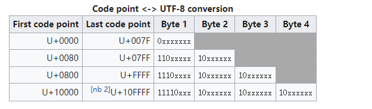
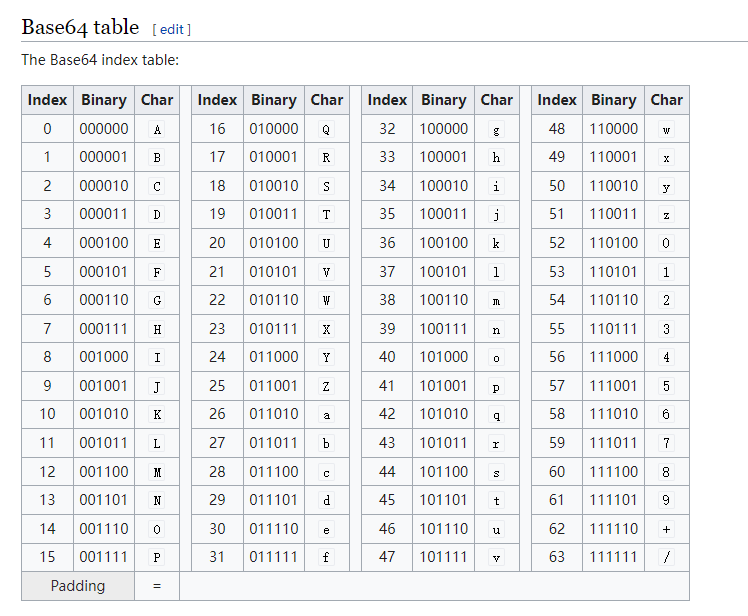
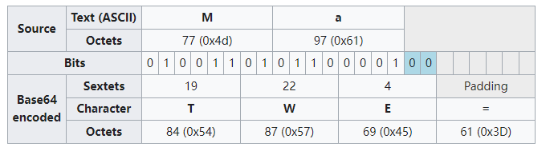

## Unicode

Unicode内的字符被数字唯一标识，称为Code Point。检索Code Point可以访问http://www.unicode.org/charts/。

Code Point一般按大的类别会规划出若干区，实际开发时，可以借助Code Point范围来确定字符所处的区，来确定类型。

## Utf8 Utf16

Utf8和Utf16等都是Unicode的编码格式，即对Unicode Code point编码。目前Utf8是广泛使用的，它是变长度的编码。

## Base64

Base64是一种二进制转文本的编码方式。每6个bit构成一个可现实的字符，由此得出可显示字符一共是2^6=64种，而每3个字节需要4个字符（24个bit）表示。效率是67%。

另外对于非3的倍数个字节，需要0填充，而填充字符是"="，即6个0bit。比如"X="表示了12个bit，但因为最后是填充，所以由此推断有效字节是前8个bit。"XX="表示了18个bit，类似的，有效字节是前16个bit。即若识别到了填充字符，只需要补充0bit到一个完整字节结束即可。

## 拓展阅读

- [wikipedia base 64](https://en.wikipedia.org/wiki/Base64#Decoding_Base64_with_padding)
- [Javascript中使用CodePoint](https://thekevinscott.com/emojis-in-javascript/)