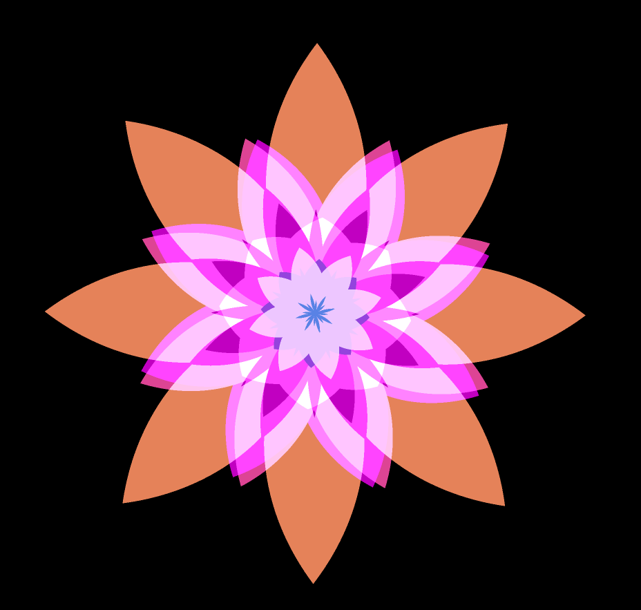
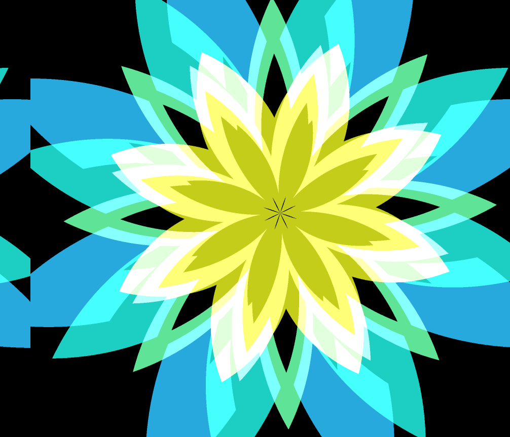

## 概述

可以访问[在线链接](https://zhangruize.github.io/tp/art/glsl/flower/)体验。

此项目是在工作之余学习glsl完成的，本来是想了解shader，但是无意之间找到了很好的glsl教程，于是用了一周学习它，期间做出了很多有趣的东西，更有代表性的是这个。其实确切的说，这里只是涉及fragment shader，即片段着色器，并没有涉及顶点着色器、几何着色器等。

## 制作思路
- 得到了一张flower的图片（by someone），就是这种规则的由重复的圆弧线条画出来的。
- 对这个图用glsl建模，先得到一个静态的花朵，完全是glsl生成的花朵。
- 引入时间，对尺寸、旋转、颜色加入时间变量，加入一些三角函数即可。

## 启发

glsl给我最大的启发其实是，原来可以站在这种角度描述图像，即输入坐标，返回一个该像素的颜色，每个像素的逻辑都独立，由此可以并发执行，并能极高效率地得到结果。而在此之前，我对图像的描述，一直建立在传统的绘制调用上，哪怕openGl不也是绘制命令吗，而对于图像文件，虽然其也是一种描述像素位置颜色的集合，但它依然没带给我glsl所给我的启发。

能用一段像素独立运行的代码，让每个像素的输出结果关联起来变得具有意义，生成出动态的画面，并且无比高效，是很酷的。

## 截图

## 拓展阅读

- [the bood of shader](https://thebookofshaders.com/00/?lan=ch)，如果对glsl有兴趣，则可以完成此教程。