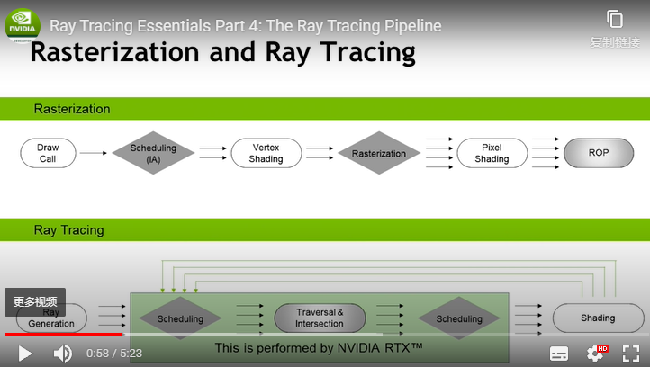

## 概述

写这篇文章已经是在完成这些工作3个多月之后了，可能有些信息已经无法精确回忆起来。这里没有在线体验，只有截图和之前备份的源码可以在文章最后下载。

这项研究旨在对最近再次受到热捧的实时光线追踪有更加深入的理解，结果来看基本达到了这个目标。从一份经典的99行代码实现路径追踪作为起点，消化并理解其中的原理，再为其拓展增加更多的优化、特性支持，最后我得到了一个可以对复杂模型进行路径追踪渲染的程序，它包含了一些简单的优化（边界盒子、初步的八叉），还借助了intel公开的降噪程序，以让整个画面在一次采样的情况下通过降噪得到远比多次迭代更具有性价比的画面。

## 路径追踪

### 概述

光线追踪是更宽泛的话题，路径追踪被认为是更具体的一种实践手段。它和我们习以为常的“光栅化”是完全不同的。光栅化目前广泛由图形驱动程序、图形硬件来支持实现，我们可以从绘制中最终得到一份像素位图，它足够快速高效所以是广泛使用的实时渲染的常规手段。

而路径追踪在相当长的时间里，被认为是离线的渲染方式，需要大量的计算来模拟光线从相机出发，在场景中所遇到的每个点，并考虑发生的光线反射、折射，因为光线在一个物体上反弹后，会变成更多的光线，它的追踪数量是指数级的。它更多被电影业界所使用。而下图是英伟达的RTX介绍，可以简单对比RayTrace和光栅化的管道差异。

### 项目代码实现概述

- 对相机的每个像素发射一条光线，沿视场方向，寻找相交物体（边界盒子查找），寻找相交三角形，得到相交点，根据三角形定义，进而计算反弹光线/折射光线
  - 如果材质是金属，则完全反弹，得到新的光线，继续递归。
  - 如果材质是玻璃，则部分反射、部分折射，即得到两条光线，结果取它们的平均。
  - 如果是一般材质，则得到折射。
  - 相交点和所有光源点建立向量，寻找是否有物体命中，若没有，说明光线可直射，否则，说明有物体遮挡，是在阴影之中。对于前者，吸纳光源作为分量。
  - 每次向下递归伴随能量损失，递归终止由“Russian roulette（俄罗斯赌盘）”算法决定。
- 采样次数是指对相机单个像素发射一条光线进行递归计算此过程的次数。

实际的采样数给定的是1，最后对结果做降噪处理。增加采样数会带来翻倍的计算，而最终依然需要降噪，多采样的降噪结果和低采样的降噪结果无明显差异。

“Monte Carlo 蒙特卡洛”是指由计算机进行广泛的随机过程来得到一个近似现实结果的方式。初中课本有讲过。

具体代码细节请参阅拓展阅读部分。

## 启发

这也是第一次遇到如此精妙的一段C程序，却可以依据对简化过的“光线方程”建模，以简单几何形状建模，对每个像素以方程为基础、以场景数据定义（包括相机、光源）为“输入源”，来得到一个尝试拟合物理现实的图像。

这些东西在真正尝试之前总会感觉是魔法一样难以触碰，但经过一段时间专心啃读，能逐渐理解背后的思路还是很有收获感的。

## 截图

借助之前做的个人项目`LoL Camera`项目里的数据资源，找了几个简单的模型用于渲染。这些图片分辨率接近1080p，渲染用时基本在15-20分钟。Macbook pro2020中高配。原图不好找了，这些是从微信朋友圈复制回来的。

## 拓展阅读

- 之前完成这些工作时的[代码备份](https://github.com/zhangruize/docs/blob/master/archive/path-tracing.zip)
- [大名鼎鼎的99行路径追踪](https://www.kevinbeason.com/smallpt/)
- [路径追踪和光栅化对比](https://medium.com/@junyingw/future-of-gaming-rasterization-vs-ray-tracing-vs-path-tracing-32b334510f1f)
- [Nvidia Ray-tracing-essentials](https://developer.nvidia.com/blog/ray-tracing-essentials-part-7-denoising-for-ray-tracing/)，建议该系列全部浏览。
- [Scratchapixel 关于PathTracing的内容](https://www.scratchapixel.com/lessons/3d-basic-rendering/global-illumination-path-tracing/global-illumination-path-tracing-practical-implementation)，里面介绍得比较清楚，可以跟随教程完成算法优化。
