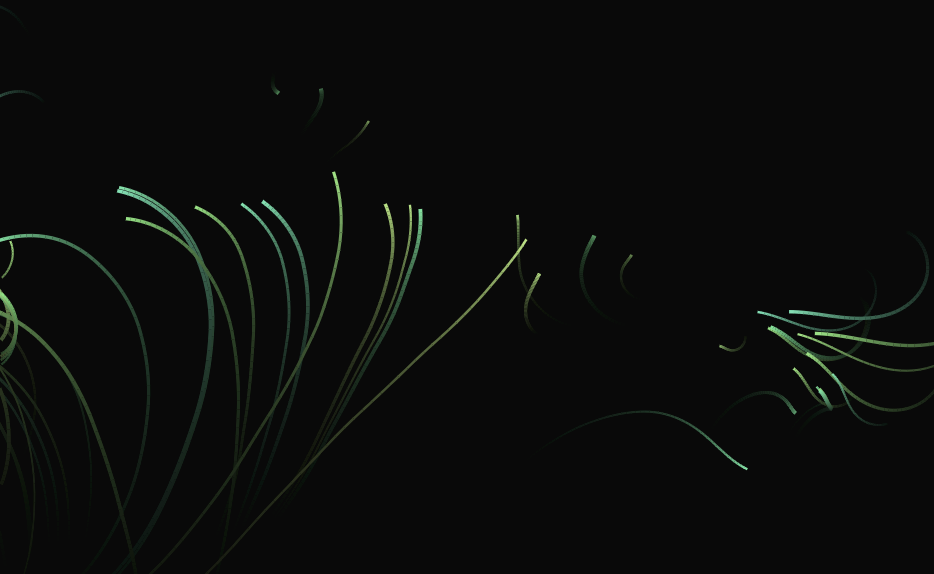

## 概述

可以访问[在线链接](https://zhangruize.github.io/tp/art/flow-field-simplex-noise/)体验。

此项目得益于Code pen上的flow filed相关介绍。确切的说，是使用了从柏林噪声函数简化后的`simplex`噪声函数来生成三维的噪声，并把噪声值作为图像里对应位置的力场，每个场里的粒子都会受到所在最近的力场作用得到新的运动状态，从而得到了粒子运动。尾迹的表现形式并非通过记录粒子历史位置，而是借助一个带瑕疵的小技巧，即每次不清除画布，而是给画布填充一个带透明度的黑色，便继续接着绘制新的画面。因而过去的内容会不断被半透明的黑色覆盖，直到几乎看不见。

## 所用技术

- 噪声生成，使用simplex noise可以得到比perlin noise更佳性能的结果。之所以需要三维的噪声，是因为画面是二维，再加一维用于迭代时间变化。
- 力场改变粒子运动状态，根据上一步骤可以得到一份随时间变化的二维噪声（将一维用于时间），将噪声平铺到图像中，可以得到每个像素距离最近的噪声点作为力场。一个力场点的方向和强度，可以按自定的规则，以不同的方式从`simplex noise`中取得。
- 绘制时只需要计算出新的粒子位置，并`lineTo`即可，当然也可以有更多的手段进行尝试，或许会有更柔软的效果。
- 通过在每帧绘制前补充一层全局的半透明背景色遮罩，从而让之前的画面逐渐褪去，达到尾迹的效果。否则只能使用历史记录方式绘制尾迹。此方式的瑕疵在于，半透明图层覆盖在一段时间里将无法彻底让其真的不可见，注意观察可以看到背景中依然有尾迹的残留。

## 截图

