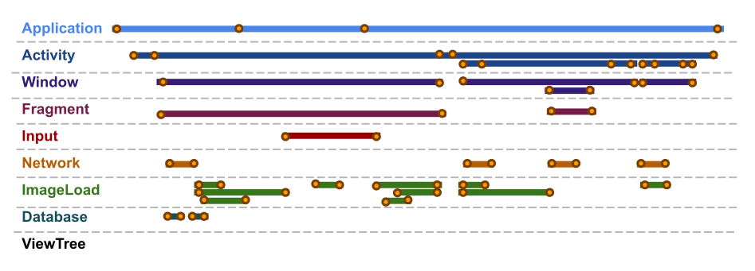

# 事件流

事件流 = { 开始事件 [中间事件...] 结束事件 }

事件 = { 时间点 事件描述 事件源 [所属页面,可见状态,成功,失败,取消] }

事件源(枚举) = { App, Activity, Window, Fragment, Input, Network, ImageLoad, Database, ViewTree }

对于所有的事件，都可以以事件流的形式进行考虑。

|事件源|事件流模型|
|---|---|
|App|OnCreate [...] OnDestroy|
|Activity|OnCreate [...] OnDestroy|
|Fragment|OnCreate [...] OnDestroy|
|Input|OnScrollStart [...] OnScrollStop|
|Input|OnTouchStart [...] OnTouchStop|
|Network|OnRequestStart [...] OnRequestFinish|
|ImageLoad|OnResourceLoadStart [...] OnResourceLoadFinish|

## 事件流图示

- 事件流之间不应该有引用、包含关系。它只是一个事情过程通过几个事件节点进行描述。它们之间的隐含关系应通过观察视图和分析挖掘得出。
- 事件流的观察方式有很多（实质上都是事件必备属性和可选属性的条件筛选）：
  - 从自定义时间段选取事件流
  - 从指定页面选取事件流
  - 只关注某事件源的事件流
  - 在某一时间段（如某一事件后到某一事件前）、在某一页面、满足某事件属性条件（如开始事件和结束事件都必须可见、且都在此页面上）的事件流
- 事件流的构建具有良好的特性：
  - 低侵入性。
  - 事件源独立性。
  - 可拓展性（可自定义虚拟的事件源，发送任何有意义的事件流）
  - API单一性。
- 事件流本身仅是会话的描述和记录。后续的分析挖掘才可以满足各类分析场景使用。

## API设计

- 类：
  - Event 事件对象
    - 成员变量
      - long eventTime
      - EventSource eventSource
    - EventSource 事件源枚举
    - 子类
      - ApplicationEvent
      - ActivityEvent
      - FragmentEvent
      - ImageLoadEvent
  - EventStream 事件流对象
    - start(Event startEvent)
    - end(Event endEvent)
    - SingleEventStream 子类，后期可使用的单事件事件流

## 事件流存储

内存 -> 数据库

## 事件流分析

数据库Sql操作 -> 自定义指标分析 -> 分析结果上报

## 事件流EventFlow, EventStream

为何需要事件流？当前开发模型的若干缺陷：

- 点击事件，跳转路径无法捕获上下文来源，无法追踪上下文信息。而这些信息对于业务追踪会有很高的诉求。
  我们处理点击事件只是在一个很小的范围（View自己的范围内一般）去做逻辑处理。跳转成功，或者触发成功响应的逻辑即可，但自身点击的上下文环境未知，比如是什么首页下的什么楼层的第几个，带有了怎样的促销id等等。
  而跳转路径上下文未知就是，虽然我们经常会跳转到商详，但商详的统一Pv埋点，却无法衡量来源渠道。

事件流模型是致力于解决此类缺陷的方案之一。它透明且轻巧。客观观察一切之后，再做实时的，亦或者是延后的分析。

ClickEvent 发生在了某个View， 从此View向上遍历ViewTree，探寻所有的TrackInfoNode（每个View树上的View节点，也通过Tag对应着TrackNode节点）。TrackNode包含了View中所有希望被记录的、被跟踪的数据。这些数据不是零散、离散的简单数据，因为这样并不便于解析使用。而是结构化的数据（XxxInfoNode, YyyInfoNode）。以此可以对应了统一抽象的解析方式。

通过